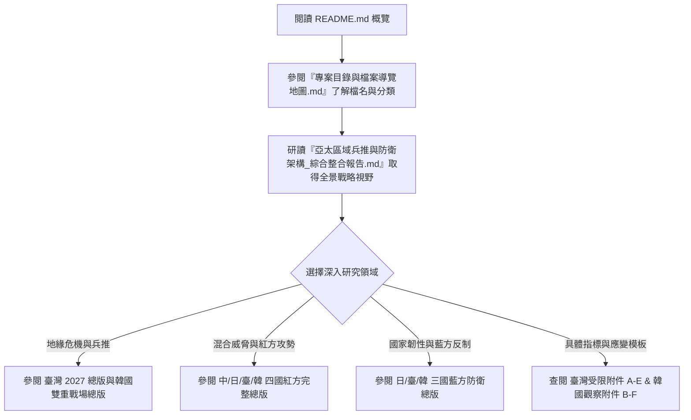

# WarOfAsia 亞太區域兵推與國家防衛韌性研究體系

> **文件定位與安全邊界聲明**
> 本研究體系採「防禦型紅隊 (Defense-oriented Red Team)」與「全社會韌性藍方 (Total Society Resilience Blue Team)」兵推方法學。
> 目的在於從假想外部敵對行為者與複合威脅角度，盤點東亞區域（臺灣、日本、韓國、中國）面臨之政治滲透、軍事威懾、灰帶襲擾、關鍵基礎設施相依脆弱性與地緣戰爭外溢風險，協助藍方建立國家持續運作 (COG)、備援驗證、應變反制與危機降級機制。
>
> - 本專案**不提供**敏感國防設施精確位置、破壞指引、網路入侵手段或暴力行動指引。
> - 所有情境推演均區分「已確認事實」與「最壞情境推演」。

---

## 📚 專案核心文件總覽 (Core Master Documents)

為了方便研究人員與防衛決策者快速掌握全貌，本專案提供以下三個層級的導覽與整合報告：

| 文件名稱                                     | 定位與說明                                                                                                              | 連結                                                                                                         |
| :------------------------------------------- | :---------------------------------------------------------------------------------------------------------------------- | :----------------------------------------------------------------------------------------------------------- |
| **專案導覽入口**                       | 本檔案 (README.md)，提供專案背景、架構地圖與導讀路徑                                                                    | [README.md](file:///i:/Project/WarOfAsia/README.md)                                                           |
| **專案檔案總地圖與導覽索引**           | 收錄全專案 72+ 份 MD 檔案之主題分類、標籤、關聯性與精確連結                                                             | [專案目錄與檔案導覽地圖.md](file:///i:/Project/WarOfAsia/專案目錄與檔案導覽地圖.md)                           |
| **亞太區域兵推與防禦體系綜合整合報告** | **萬字核心總報告**：深度整合紅藍方攻防矩陣、2027臺海演練、朝俄雙重戰場、CI相依性與預警指標（附 Mermaid 戰略圖表） | [亞太區域兵推與防衛架構_綜合整合報告.md](file:///i:/Project/WarOfAsia/亞太區域兵推與防衛架構_綜合整合報告.md) |

---

## 🌏 四大區域模組架構 (Regional Modules)

本專案將東亞戰略兵推與混合威脅劃分為四大區域專題資料夾：

```
WarOfAsia/
├── 中國/      (12 份文檔：紅方黨國體系、戰狼政策、灰帶滲透與反制架構)
├── 日本/      (9  份文檔：紅方西南諸島滲透與日美分離 / 藍方國民保護與社會韌性)
├── 臺灣/      (31 份文檔：2027侵臺複合評估、紅方政治迫降演練 / 藍方多國兵推與 CI 相依附件)
└── 韓國/      (20 份文檔：中俄朝複合施壓、臺海外溢與北韓第二戰場兵推、觀察附件)
```

### 1. 🇨🇳 中國模組 (`/中國`)

- **重點內容**：中國戰狼政策對內外影響分析、黨國體系集中指揮與資訊失真脆弱性、對臺實體模型區域模擬、國家級反制與全社會防衛。
- **代表性總版**：
  - [中國紅方國家級滲透與混合威脅架構_完整總版.md](file:///i:/Project/WarOfAsia/中國/中國紅方國家級滲透與混合威脅架構_完整總版.md)
  - [中國戰狼政策_內外紅方整合與他國反制_完整總版.md](file:///i:/Project/WarOfAsia/中國/中國戰狼政策_內外紅方整合與他國反制_完整總版.md)

### 2. 🇯🇵 日本模組 (`/日本`)

- **重點內容**：日本紅方滲透與日美同盟分離戰略、西南諸島軍事壓迫、藍方國民保護、地方治理與全社會防衛架構。
- **代表性總版**：
  - [日本紅方國家級滲透與混合威脅架構_完整總版.md](file:///i:/Project/WarOfAsia/日本/日本紅方國家級滲透與混合威脅架構_完整總版.md)
  - [日本藍方國家持續運作與全社會防衛架構_完整總版.md](file:///i:/Project/WarOfAsia/日本/日本藍方國家持續運作與全社會防衛架構_完整總版.md)

### 3. 🇹🇼 臺灣模組 (`/臺灣`)

- **重點內容**：2027 中共侵臺基準情境、十七項複合預警指標、紅方海空隔離與政治迫降演練、藍方關鍵基礎設施 (CI) 數位與通信韌性、多國地緣兵推、受限附件模板 (A-E)。
- **代表性總版**：
  - [2027中共侵臺情境_區域軍政環境與複合預警評估_完整總版.md](file:///i:/Project/WarOfAsia/臺灣/2027中共侵臺情境_區域軍政環境與複合預警評估_完整總版.md)
  - [臺灣紅方國家級滲透與混合威脅架構_完整總版.md](file:///i:/Project/WarOfAsia/臺灣/臺灣紅方國家級滲透與混合威脅架構_完整總版.md)
  - [臺灣藍方_中共複合侵略之應變預防反制與多國兵推_完整總版_更新版.md](file:///i:/Project/WarOfAsia/臺灣/臺灣藍方_中共複合侵略之應變預防反制與多國兵推_完整總版_更新版.md)

### 4. 🇰🇷 韓國模組 (`/韓國`)

- **重點內容**：中俄朝（中國、北韓、俄羅斯）三方協同對韓複合施壓、2027 臺海危機外溢至朝鮮半島之第二戰場兵推、美韓同盟與日韓協同支援架構、紅藍方觀察與應變附件 (B-F)。
- **代表性總版**：
  - [韓國紅方_中國北韓俄羅斯對韓複合施壓與雙重戰場兵推_完整總版.md](file:///i:/Project/WarOfAsia/韓國/韓國紅方_中國北韓俄羅斯對韓複合施壓與雙重戰場兵推_完整總版.md)
  - [韓國藍方_臺海外溢北韓第二戰場與中國複合威脅_完整總版.md](file:///i:/Project/WarOfAsia/韓國/韓國藍方_臺海外溢北韓第二戰場與中國複合威脅_完整總版.md)

---

## 🧭 推薦閱讀路徑 (Recommended Reading Paths)



---

## 🛠️ 專案維護與使用規範

1. **版本與相依性**：所有 Markdown 文件均保持獨立完整性，若需查詢具體卷數細節，可參閱各資料夾內之 `MD文件索引.md` 或全專案之 [專案目錄與檔案導覽地圖.md](file:///i:/Project/WarOfAsia/專案目錄與檔案導覽地圖.md)。
2. **格式標準**：新撰寫之導覽與整合報告均採 UTF-8 編碼與 Standard GitHub-Flavored Markdown (GFM) 格式，支援內嵌 Mermaid 流程與狀態圖表。
