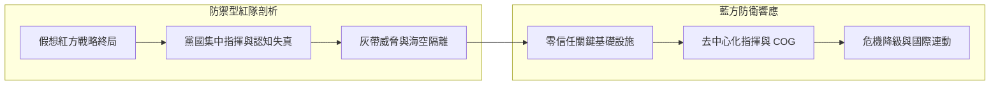

# 兵推與韌性方法論白皮書 (War Game & Resilience Methodology)

本白皮書闡述 `WarOfAsia` 專案所採用之「防禦型紅隊 (Defense-oriented Red Team)」與「全社會防衛韌性 (Whole-of-Society Resilience)」核心理論架構。

---

## 1. 防禦型紅隊方法學 (Defense-oriented Red Teaming)

傳統紅隊演練常著重於攻擊技術，而「防禦型紅隊」則以**假想敵對行為者的戰略思維與系統性脆弱點剖析**為核心，服務於受害方之防禦機制建置。

### 1.1 黨國集中指揮與「單一情勢圖失真」模型
集中式威權體系雖然在和平時期具備快速資源動員優勢，但在危機時期面臨「認知單點脆弱性 (Single-Point Cognitive Failure)」：
- **基層報喜不報憂**：官員為避免問責低報損失與庫存，導致高層在錯誤數據基礎上執行高成本決策。
- **多戰區與跨部門協同摩擦**：當東部戰區、南部戰區、公安與應急管理部同時搶奪後勤資源時，跨部門溝通成本急劇增加。

---

## 2. 全社會防衛韌性 (Whole-of-Society Resilience)

藍方（臺灣、日本、韓國）應對複合侵略不能單靠國軍正規兵力，必須建立涵蓋全社會的韌性網。

### 2.1 三層防衛矩陣

| 防禦層級 | 核心焦點 | 防禦與降級機制 |
| :--- | :--- | :--- |
| **第一層：國家持續運作 (COG)** | 指揮鏈與法律授權 | 正副元首與閣員緊急代理順位（受限附件 A） |
| **第二層：關鍵基礎設施 (CI)** | 電力、水利、通訊、金融 | 零信任資安、微電網、高空微波與低軌衛星備援（受限附件 B/D/E） |
| **第三層：民生與地方社會** | 醫療救護、物資配給、地方自治 | 戰傷血庫庫存、離島避難引導（日本國民保護法）、民防團隊運用 |

---

## 3. 危機升級與降級決策矩陣

本專案採用動態升降級指標，定義危機階段轉換條件：
- **升級觸發 (Escalation)**：當預警指標中軍事動員、CI 資安入侵與大宗物資囤積累積超過 35% 權重時，系統判定進入黃燈警戒；超過 75% 進入紅燈高危機。
- **降級條件 (De-escalation)**：當紅方遭受國際制裁反噬、內部資訊失真導致後勤中斷，或藍方堅守引致外交介入時，觸發降級談判機制。
