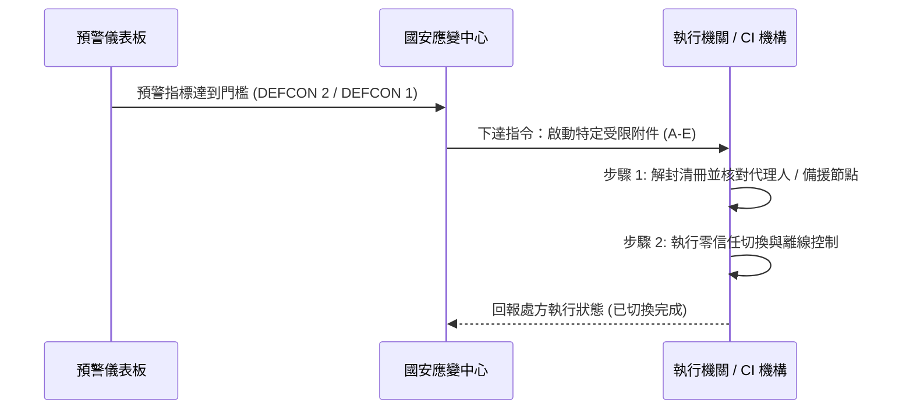

# 受限附件運作與填報手冊 (Restricted Annexes Operational Manual)

本手冊規範 `WarOfAsia` 專案中受限附件 (Restricted Annexes A-E / B-F) 之結構欄位、機密保護原則與平戰轉換操作清冊。

---

## 📋 受限附件分類與功能對照

受限附件為藍方政府與防護機構於危機發生時之**實體操作清冊與模板**。

| 附件代號 | 附件名稱 | 適用國家 | 核心維護內容 | 機密等級與權限 |
| :--- | :--- | :--- | :--- | :--- |
| **受限附件 A** | 國家核心功能與代理順位清冊 | 臺灣 | 正副元首、行政院長、閣員與軍事指揮官緊急代理順位與授權書 | 絕密 (Top Secret) |
| **受限附件 B** | 關鍵基礎設施相依與替代節點 | 臺灣 / 韓國 | 電網、水利、油氣、電信樞紐相依鏈與備援柴油/發電機替代節點 | 機密 (Secret) |
| **受限附件 C** | 高權限人員與供應商風險清冊 | 臺灣 | 機密系統 Root/Admin 帳號名冊、外包商資安風險與多重 MFB 驗證 | 密 (Confidential) |
| **受限附件 D** | VPN / eSIM 跨境通信供應鏈清冊 | 臺灣 / 韓國 | 跨境數據漫遊通道、中資背景電信商風險清查與加密專用 VPN 白名單 | 密 (Confidential) |
| **受限附件 E** | 海纜衛星與緊急通信容量 | 臺灣 / 韓國 | 海底電纜登陸站備援、低軌/中軌衛星 (LEO/MEO) 頻寬配額與微波對點連線 | 機密 (Secret) |
| **韓國附件 B-F** | 美韓聯合防衛/資金/第二戰場/國際支援 | 韓國 | 駐韓美軍 (USFK) 基地支援、中資監測、北韓 DMZ 預警與美日臺澳聯絡 | 機密 (Secret) |

---

## 🛠️ 平戰轉換三步驟操作清冊

### 步驟 1：預警觸發與清冊解封
當 Web 儀表板或情報系統顯示預警分數達標，國安應變中心發布指令解封對應附件。

### 步驟 2：執行零信任與替代切換
- **附件 B 執行**：主電網隔離，啟動備用微電網與 30 天柴油發電。
- **附件 D/E 執行**：切斷具中資背景之漫遊通道，開啟 LEO 低軌衛星緊急數據傳輸。

### 步驟 3：狀態回報與降級復原
執行完成後，透過加密微波通道回報國安中心，並保留完整異動日誌 (Audit Log)。
