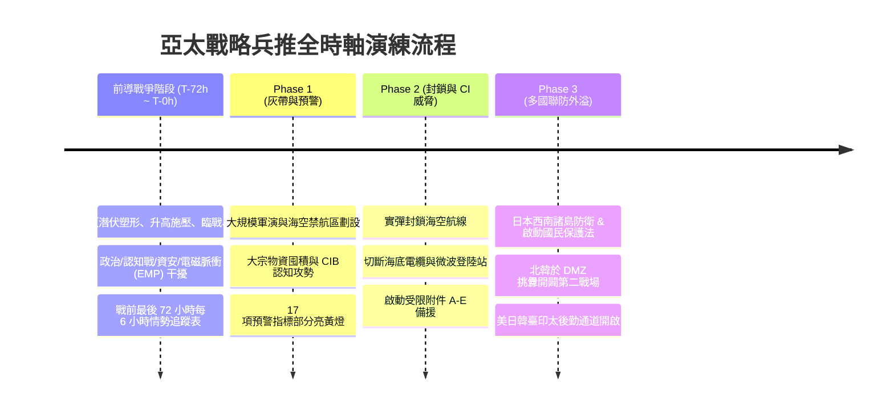

# 2027 臺海危機、前導戰爭與區域地緣演練情境規範 (2027 War Game Scenarios)

本文件詳細規範 `WarOfAsia` 專案中 **臺灣前導戰爭 (正式開戰前破壞干擾)**、**2027 臺海危機基準情境** 與 **日本西南諸島、韓國朝鮮半島第二戰場** 地緣外溢兵推之推演規範。

---

## 🎯 兵推完整時間軸：從「前導戰爭」至「多國戰場連動」

---

## 1. 臺灣前導戰爭專題 (Pre-War Sabotage Operations)

- **定義**：紅方在發動全面軍事打擊前（T-72h 至 T-0h），所採取的隱蔽性破壞、電磁干擾、內應網路啟用與社會秩序騷擾。
- **概念四階段**：
  1. **潛伏塑形**：平時進行資安掃描、高權限帳號竊取與關鍵基礎設施 (CI) 零日漏洞植入。
  2. **升高施壓**：大宗物資停報、假訊息 (Deepfake) 散播與金融市場干擾。
  3. **戰術臨戰 (T-72h)**：啟用潛伏內應、電磁干擾海纜站與發動海警「執法臨檢」準封鎖。
  4. **全面爆發 (T-0h)**：對軍政指揮中心實施電子打擊，嘗試逼迫簽署「政治迫降」協議。
- **兵推裁決規範（第八卷）**：演練設置 Control 裁判組，依據藍方受限附件 A-E 反制速度動態裁決 Inject 事件成功率。

---

## 2. 階段一：灰色地帶與預警階段 (Gray-Zone & Pre-Warning)

- **情境描述**：紅方以「例行聯合演習」為名，於臺灣海峽與西南防空識別區 (ADIZ) 大規模劃設禁航區。
- **指標條件**：預警指標 m1、m2、m6、m11 亮黃燈。
- **演練重點**：藍方國安團隊情情共享、監控外資離岸動態、檢視 CI 資安零信任防護。

---

## 3. 階段二：海空隔離與關鍵基礎設施切斷 (Isolation & CI Blockade)

- **情境描述**：紅方封鎖主要海運航道，並發動 APT 網路攻擊切斷主要海底電纜與微波登陸站，伴隨「美軍棄臺」認知作戰。
- **指標條件**：預警指標 m3、m12、m14 亮紅燈，分數突破 50%。
- **演練重點**：
  1. 臺灣藍方啟動受限附件 A（政府代理順位）與受限附件 B（電網與能源替代節點）。
  2. 切換至受限附件 E（低軌衛星 LEO 與高空微波緊急連線）。

---

## 4. 階段三：印太多國聯防與地緣外溢 (Alliance & Dual-Battlefield)

- **情境描述**：衝突升級為印太區域層級。日本西南諸島面臨周邊海空牽制；北韓於 DMZ 發射飛彈並動員兵力，開啟朝鮮半島第二戰場。
- **指標條件**：預警指標 m15、m16、m17 亮紅燈，分數突破 75%。
- **演練重點**：
  1. **日本藍方**：啟動《國民保護法》，引導與那國島、石垣島住民撤離至九州。
  2. **韓國藍方**：處置北韓 DMZ 挑釁，確保駐韓美軍 (USFK) 後勤動員，維護黃海與韓半島安全。
  3. **美日韓臺印太聯防**：建立國際人道與戰術補給綠色通道。
