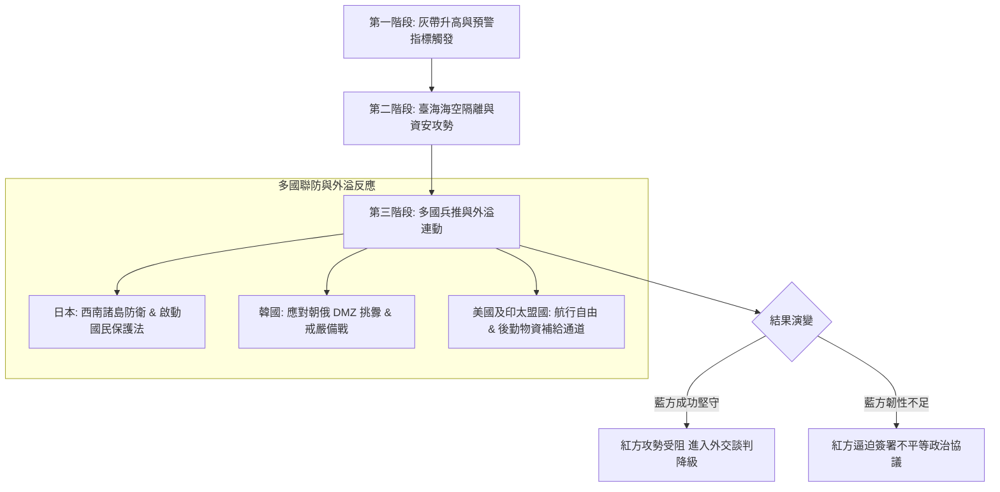

# 亞太區域兵推與防衛架構｜綜合整合報告

> **本報告定位與研究聲明**
> 本報告為 `WarOfAsia` 專案之核心高階綜合分析報告。本報告嚴格採用「防禦型紅隊 (Defense-oriented Red Team)」與「全社會韌性藍方 (Total Society Resilience Blue Team)」兵推方法學，全方位整合中國、日本、臺灣、韓國四大東亞主要戰略主體之研判結果。
> 目的在於盤點國家安全脆弱點、灰帶滲透模式、關鍵基礎設施 (CI) 相依風險，並建立國家持續運作 (COG)、跨國兵推外溢應變與危機降級機制。
> - 本報告**不包含**國防敏感設施精確座標、網絡破壞指令或暴力侵略指引。
> - 報告中所有最壞情境推演均標註為推演分析，非既成事實。

---

## Executive Summary 執行摘要

當前東亞安全情勢已從單一防衛區衝突演變為「複合式、跨國界、多戰區連動」的混合威脅模式。中共（紅方）透過「戰狼外交、灰帶封鎖、黨國一體化滲透、認知操弄」等手段，結合俄羅斯與北韓（朝俄協同），試圖在印太區域創造「既成事實 (Fait Accompli)」。

為了有效因應此一挑戰，藍方（臺灣、日本、韓國及美日韓臺印太聯防體系）必須從傳統「軍事防衛」維度提升至「全社會防衛韌性 (Whole-of-Society Resilience)」，強化國家指揮體系持續運作 (COG)、數位通訊備援、關鍵基礎設施防護與跨國情報連動機制。

---

## 1. 紅方複合威脅與攻勢矩陣 (Red Team Threat Matrix)

### 1.1 黨國體系與戰狼政策戰略終局
外部紅方在戰略上並不一定以「直接軍事全面占領」為唯一目標，其戰略終局著重於：
1. **認知與政治迫降**：削弱藍方政府決策品質與治理信任，迫使藍方在資訊不對稱與內部混亂下簽署不平等政治協議。
2. **戰狼政策與灰帶施壓**：對內結合強烈民族主義鞏固政權穩定；對外透過外交孤立、經濟脅迫與海空灰色地帶侵擾（如頻繁進入防空識別區 ADIZ、跨越中線、實彈演習封鎖航道）增加藍方常態應對成本。

### 1.2 黨國集中指揮之脆弱性分析
儘管紅方集中指揮具備快速動員優勢，但其體系存在致命脆弱點：
- **資訊單點失真**：基層官員「報喜不報憂」，可能導致中央高層在遭污染或低報的災情/軍事數據下執行錯誤決策。
- **多戰區資源分散**：當東部戰區、南部戰區與公安武警同時承擔多項動員任務時，跨部門調度摩擦將急劇增加。

### 1.3 東亞多戰區與朝俄協同連動
在韓國與日本紅方卷中顯示，紅方攻勢呈現跨國連動：
- **臺海主戰場**：以海空隔離、海底電纜切斷與實體模型演練進行心理威懾。
- **西南諸島包圍**：日本紅方聚焦切割日美同盟，對與那國島、石垣島實施海空牽制。
- **朝鮮半島第二戰場**：利用北韓在 DMZ 進行兵力集結與飛彈挑釁，牽制駐韓美軍 (USFK) 與韓國軍隊，防止其支援臺海。

---

## 2. 藍方國家韌性與全社會防衛體系 (Blue Team Resilience)

藍方防衛架構的核心在於「就算遭遇最嚴苛灰帶封鎖或通訊中斷，國家機能仍能持續運作」。

```mermaid
graph TD
    subgraph 國家持續運作 (COG)
        A1[元首與國安會應變指揮中心] --> A2[緊急代理順位清冊 (附件A)]
        A2 --> A3[分層備援指揮基地]
    end

    subgraph 關鍵基礎設施 (CI) 韌性
        B1[電網/水利/石油備援] --> B2[替代節點與備用發電 (附件B)]
        B3[海底電纜登陸站防護] --> B4[微波/低軌衛星星系 (附件E)]
    end

    subgraph 民生與地方韌性
        C1[醫療與戰傷救護量能] --> C2[戰略糧食與物資配給]
        C2 --> C3[地方民防團隊與防空避難]
    end

    COG --> CI韌性
    CI韌性 --> 民生與地方韌性
```

### 2.1 國家指揮體系持續運作 (COG)
- **緊急代理順位**：確立國家元首、行政院長與核心國安成員在不可抗力狀況下的法律授權與代理順位（參閱 `臺灣受限附件A`）。
- **零信任指揮架構**：建立去中心化的戰術指令下達機制，防止單點指揮所遭毀損導致運作停擺。

### 2.2 關鍵基礎設施 (CI) 與數位/通信韌性
- **電網與能源備援**：分散式微電網建置，確保醫院、指揮所與通訊樞紐在主電網失能下仍具備 30 天以上獨立運作能力（參閱 `臺灣受限附件B`）。
- **緊急通訊多元路徑**：結合海底電纜、高空微波、非同步軌道衛星（LEO/MEO），防範資安攻擊與實體電纜切斷風險（參閱 `臺灣受限附件E`）。

### 2.3 國民保護與地方治理（日本/臺灣實踐）
- **離島住民撤離計畫**：日本藍方建立西南諸島住民避難引導機制；臺灣藍方規劃本島防空避難物資庫存管理與地方救援體系。

---

## 3. 2027 臺海危機與多國兵推外溢效應 (War Game & Spillover)



### 3.1 2027 臺海危機基準情境時間軸
1. **複合預警階段**：17 項預警指標部分亮燈（如中國大宗物資囤積、血庫調度異常、外資異常抽離）。
2. **灰色地帶封鎖階段**：以演習為名實施海空禁航區，宣告切斷臺灣對外海運航道。
3. **資訊與網路切斷**：目標攻擊關鍵資通訊系統，配合 VPN/eSIM 資料洩漏引發社會恐慌。

### 3.2 日本與韓國的外溢連動分析
- **日本西南諸島**：與那國島離臺灣僅 110 公里，日本將臺海危機視為「存立危機事態」，必然啟動自衛隊部署與美日共同作戰機制。
- **韓國雙重戰場危機**：北韓可能趁臺海混局在黃海或 DMZ 進行武力挑釁。韓國藍方必須在「支援印太穩定」與「防守北韓入侵」之間取得戰略平衡。

---

## 4. 危機預警指標與受限附件相依性分析 (Warning Metrics & Annexes)

### 4.1 十七項複合預警指標摘要 (臺灣 2027 卷)
本專案建立三級燈號機制（綠色常態、黃色警示、紅色危機）：
1. **軍事動員類**：後備部隊徵召規模、戰術飛彈推至前緣陣地、海軍艦艇出港率超過 85%。
2. **經濟與民生類**：戰略物資（石油、天然氣、鐵礦）進口異常激增、金融市場外資連日大規模撤出。
3. **資訊與社會類**：大量海外假帳號進行協同行為、跨境 VPN/eSIM 異常數據流量、高權限帳號遭異常登入。

### 4.2 受限附件與資安清冊對照表

| 附件代號 | 附件名稱 | 關鍵控管項目 | 風險降級措施 |
| :--- | :--- | :--- | :--- |
| **受限附件 A** | 國家核心功能與代理順位 | 院長、閣員與國軍指揮官代理順序 | 預先實體簽署授權書，備援指揮所隨時同步 |
| **受限附件 B** | CI 相依與替代節點 | 電能、水利、石油、通訊相依節點 | 建立發電機柴油儲量庫與零信任切換斷路器 |
| **受限附件 C** | 高權限人員與供應商風險 | 政府外包商、系統管理者帳號名冊 | 強制實施多重身分驗證 (MFA) 與獨立審計 |
| **受限附件 D** | VPN/eSIM 跨境通信供應鏈 | 跨境數據漫遊、中國資助電信商 | 清查敏感機關使用中國背景通訊技術之風險 |
| **受限附件 E** | 海纜衛星緊急通信容量 | 海底電纜登陸站、LEO 衛星頻寬 | 簽署國際低軌衛星緊急接入協定與微波對點備援 |

---

## 5. 結論與戰略建議 (Conclusion & Policy Recommendations)

1. **從軍事防禦擴建至全社會防衛**：強化民航、醫療、通訊與地方政府的平戰轉換能力。
2. **建立跨國預警與資安共享網絡**：臺美日韓應建立即時灰色地帶威脅與資安情報分享機制。
3. **落實關鍵基礎設施替代節點演練**：定期進行「網路完全切斷」與「主電網停電」下的實境模擬應變演練。

---

## 📌 相關導覽與參照連結

- **返回專案總頁**：[README.md](./README.md)
- **查閱完整 72+ 檔案地圖**：[專案目錄與檔案導覽地圖.md](./專案目錄與檔案導覽地圖.md)
