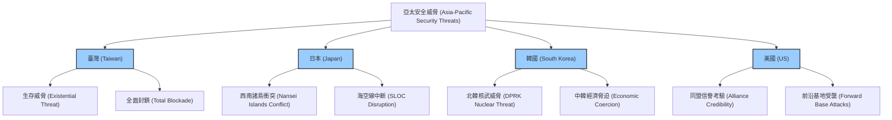
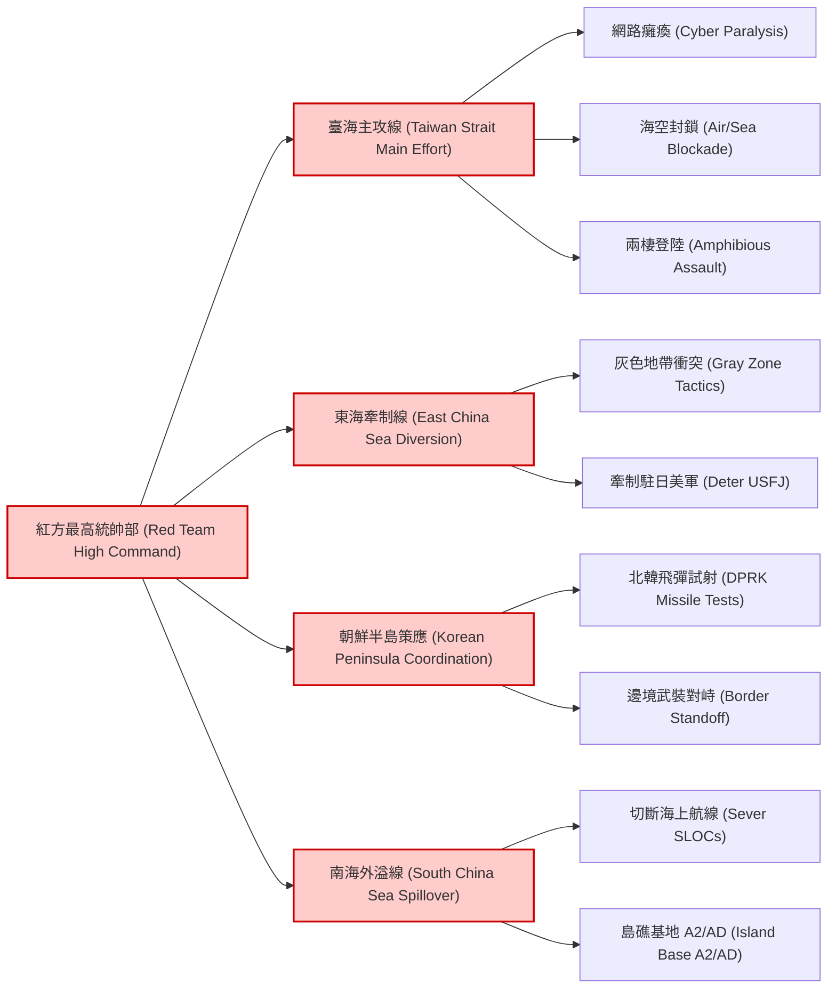
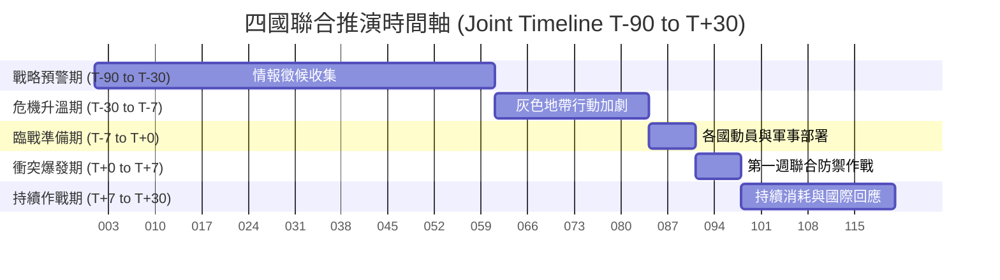
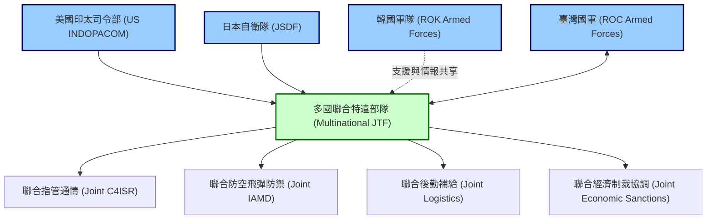
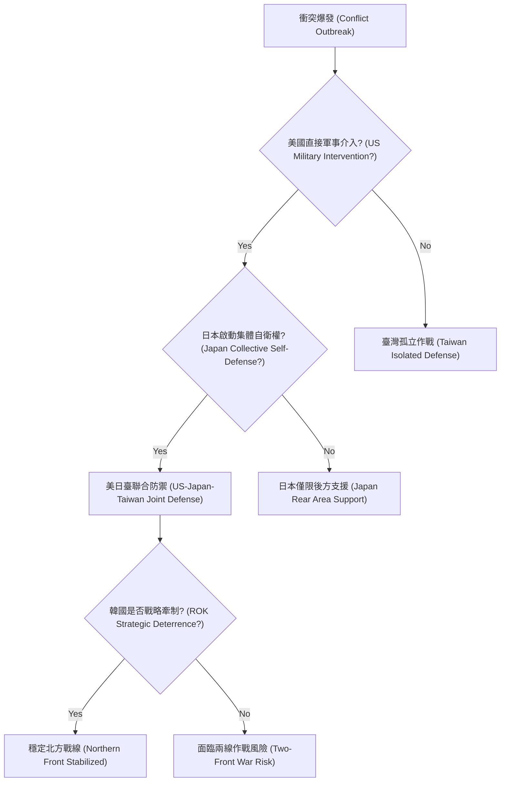

# 專題研究：四國聯合兵棋統合報告（Four-Nation Joint Wargame Integration Report）

> **防禦研究聲明 (Defense Research Disclaimer)**
> 本報告純屬學術防禦與地緣政治研究，旨在探討亞太區域潛在的安全威脅與防衛架構。報告內容不代表任何官方立場，推演情境均為基於公開資訊與戰略理論之假設性推演。本報告中，「紅方（Red Team）」代表中華人民共和國（PRC）及中國人民解放軍（PLA）的戰略威脅體系；「藍方（Blue Team）」代表防禦方及聯盟力量（臺灣、日本、韓國及美國）。

---

## 1. 統合推演概述（Joint Wargame Overview）

### 1.1 推演目的
本次「四國聯合兵棋統合推演」的核心目的在於驗證臺灣、日本、韓國與美國在面對紅方（Red Team）「同步多線施壓（Multi-Front Pressure）」時的協同防禦能力（Coordinated Defense Capabilities）。在印太戰略格局下，單一節點的防禦已無法有效應對全域威脅，必須透過跨國安全網路進行戰略資源整合。

### 1.2 推演假設與基準情境（Baseline Scenario: 2027-2029）
推演設定在 2027-2029 年之間，假設紅方已完成軍隊現代化目標，具備在第一島鏈（First Island Chain）內實施聯合全域作戰（Joint All-Domain Operations）與反介入/區域拒止（A2/AD）的能力。

### 1.3 四國各自角色定位
- **臺灣（Taiwan）**：前線防禦核心（Frontline Defense Core），承受首波且最密集的軍事打擊與封鎖。
- **日本（Japan）**：關鍵後勤樞紐與側翼防衛（Crucial Logistics Hub and Flank Defense），負責西南諸島（Nansei Islands）的防衛及支援美軍行動。
- **韓國（South Korea）**：北方牽制力量（Northern Deterrence Force），主要防範北韓（DPRK）趁機挑釁，維持東北亞穩定，避免藍方陷入兩線作戰。
- **美國（United States）**：區域安全後盾與主力打擊力量（Regional Security Guarantor and Main Strike Force），提供戰略指管通情（C4ISR）與遠程火力打擊。

### 1.4 紅方全域施壓戰略概念（Multi-Domain Integrated Operations）
紅方採用「混合戰（Hybrid Warfare）」，結合網路攻擊（Cyber Attacks）、太空拒止（Space Denial）、認知戰（Cognitive Warfare）與傳統軍事力量，對四國實施非對稱與同步打擊。

---

## 2. 四國安全態勢比較分析

### 2.1 各國戰略困境
- **臺灣**：位於第一島鏈核心，面臨直接的軍事併吞威脅，缺乏正式同盟條約保障。
- **日本**：西南諸島防衛壓力劇增，為美日同盟（US-Japan Alliance）的樞紐，國內政治對集體自衛權（Collective Self-Defense）有嚴格限制。
- **韓國**：面臨半島安全困境（Security Dilemma），同時在中美之間面臨戰略抉擇，擔憂北韓核武威脅（Nuclear Threat）。
- **區域安全架構**：從傳統的「軸輻體系（Hub-and-Spoke Model）」逐漸轉向「網格化架構（Lattice Model）」。

### 2.2 四國安全威脅比較矩陣

---

## 3. 紅方多線同步施壓情境（Red Team Multi-Front Pressure）

### 3.1 臺海主攻線：軍事封鎖與登陸威脅
在臺海主攻線（Taiwan Strait Main Effort）上，紅方的目標是速戰速決（Rapid Decisive Operation），避免外部勢力介入。戰術行動自 T-30 起以海警與海上民兵的灰色地帶戰術（Gray Zone Tactics）為先導，實施對臺北、高雄等主要港口「隔離（Quarantine）」，攔截往來商船，並切斷部分海底電纜以造成臺灣內部恐慌與經濟停擺。
進入 T-7 臨戰準備階段，紅方東部戰區（Eastern Theater Command）將啟動大規模海空軍演，轉為實質的海空全面封鎖（Air/Sea Blockade），並實施網路癱瘓（Cyber Paralysis），針對臺灣關鍵基礎設施（電力、通訊、交通）進行分散式阻斷服務攻擊（DDoS）及進階持續性威脅（APT）植入，削弱藍方指管通情系統。
T+0 衝突爆發時，紅方火箭軍（Rocket Force）將對臺灣軍用機場、雷達站與防空陣地實施第一波精準打擊（Precision Strike）。隨後，兩棲合成旅與海軍陸戰隊藉助滾裝輪（Ro-Ro Ships）及氣墊登陸艇（LCAC）發起兩棲登陸（Amphibious Assault）與直升機機降的垂直突擊。紅方的時間節點極為緊湊，力圖在 T+7 天內於臺灣北部或南部建立穩固的登陸場，並在美國與日本主力部隊完成集結前造成既定事實（Fait Accompli）。

### 3.2 東海牽制線：釣魚臺與西南諸島危機升級
為防止日本自衛隊（JSDF）及駐日美軍（USFJ）介入臺海，紅方在東海牽制線（East China Sea Diversion）採取「佯攻與拒止並行」策略。在 T-30 期間，紅方大量增派海警船與漁船侵入釣魚臺/尖閣諸島（Senkaku Islands）領海，迫使日本海上保安廳與海上自衛隊耗費大量資源進行周旋。
進入 T-7 後，紅方北部戰區與東部戰區的海空兵力會在宮古海峽（Miyako Strait）及沖繩周邊空域實施高強度巡邏，甚至發射短程彈道飛彈（SRBM）落入日本專屬經濟區（EEZ）以示警告。若日本政府決定啟動「存立危機事態」支援美軍，紅方在 T+0 將升級行動，對琉球群島的美日雷達站及反艦飛彈陣地實施電磁壓制（Electronic Warfare Suppression）及有限的火力打擊，迫使日本將兵力鎖定於西南諸島防衛，無法有效馳援臺灣。這條戰線的核心在於「戰略牽制」，利用日本對本土安全的擔憂，遲滯藍方聯軍的集結與干預速度。

### 3.3 朝鮮半島策應：北韓核武危機升級配合
朝鮮半島策應（Korean Peninsula Coordination）是紅方整體戰略中最具槓桿效應的一環。紅方透過政治與物資承諾，協調北韓（DPRK）在 T-30 至 T-7 期間刻意製造危機。北韓可能進行第六次核試驗或連續試射洲際彈道飛彈（ICBM），並在非軍事區（DMZ）附近增加砲兵部署與實彈演習。
此舉將迫使韓國軍隊（ROK Armed Forces）與駐韓美軍（USFK）將注意力與防空資源（如薩德系統 THAAD、愛國者飛彈）全數集中於半島防禦，無法抽調戰機或艦艇支援臺海。進入 T+0 後，北韓可能發起有限的邊境武裝對峙（Border Standoff）或網路攻擊，使首爾面臨直接的生存威脅。由於韓國深恐兩線作戰風險（Two-Front War Risk），這種「代理人牽制」將極大化紅方的戰略空間，並可能導致美韓同盟在是否介入臺海議題上產生嚴重分歧。

### 3.4 南海外溢線：島礁衝突與航線切斷
南海外溢線（South China Sea Spillover）的作用在於切斷藍方的經濟命脈與後勤補給線（SLOCs）。在 T-30 期間，紅方南部戰區（Southern Theater Command）會藉由海上民兵與海警，在仁愛礁、黃岩島等爭議海域與菲律賓發生低烈度衝突，吸引美國第七艦隊部分兵力南下。
衝突爆發（T+0）後，紅方將利用其在南沙與西沙群島的軍事化人工島礁（Militarized Artificial Islands）作為「不沉的航空母艦」，部署反艦彈道飛彈（ASBM, 如 DF-21D）與遠程防空系統，建立南海的「反介入/區域拒止（A2/AD）」泡沫。紅方海軍潛艦部隊亦將前推至巴士海峽與麻六甲海峽咽喉，威脅通過的日韓能源運輸船與美軍後勤補給艦。藉由實質封鎖南海，紅方意圖對日本與韓國施加極限的經濟壓力，迫使其國內輿論轉向綏靖，從而瓦解四國聯合防禦的決心。

### 3.5 紅方多線施壓架構圖

---

## 4. 聯合推演時間軸（Joint Timeline T-90 to T+30）

本推演參照「48小時快速想定」與「南海衝突情境」之時間軸進行整合。

---

## 5. 藍方跨國協同防禦架構

### 5.1 美日安保條約啟動條件的法律分析
日本在臺海衝突中的介入程度取決於對事態的法律認定。依據日本 2015 年通過的和平安全法制：
- **重要影響事態（Important Influence Situations）**：若判定臺海危機將對日本的和平與安全產生重大影響，日本可對美軍提供後勤支援（如油料補給、醫療後送、搜救），但自衛隊不得進入戰鬥區域。
- **存立危機事態（Survival Crisis Situations）**：若與日本關係密切的國家（如美國）遭受武力攻擊，且此攻擊威脅到日本的存立，日本可行使「集體自衛權（Collective Self-Defense）」。在紅方攻擊駐日美軍基地（如嘉手納基地）或封鎖日本生命線（西南航道）時，此條款極可能被觸發，允許自衛隊直接參與對抗紅方的防衛作戰。

### 5.2 美韓共同防衛條約的臺海適用性辯論
駐韓美軍（USFK）若被抽調支援臺海，是否符合《美韓共同防衛條約》存在巨大爭議。韓國政府長期主張該條約旨在防禦北韓對韓國的武力攻擊。若美國要求韓國提供駐韓基地作為臺海作戰的後勤中繼，或要求韓國空軍護航美軍機群，將引發韓國國內強烈的政治反彈。推演顯示，韓國最有可能採取的「底線妥協」是默許駐韓美軍部分空軍兵力南下，但韓國國軍將維持最高戒備，專注於嚇阻北韓（Northern Deterrence），拒絕直接參與對紅方的軍事行動。

### 5.3 四國情報共享機制（GSOMIA 與 Five Eyes 延伸）
在多域作戰中，情報的即時互通是勝敗關鍵：
- **日韓 GSOMIA（軍事情報保護協定）**：在此情境下，日韓需克服政治分歧，利用 GSOMIA 即時共享北韓飛彈動態與紅方北部戰區的海空調度，確保雷達盲區得以互補。
- **五眼聯盟（Five Eyes）延伸（Five Eyes Plus）**：美國將作為超級情報中樞，將高解析度衛星圖像、電子偵察（SIGINT）與紅方潛艦聲紋數據即時分享給日本、臺灣及韓國。透過 Link 16 等戰術資料鏈的介接，四國可建立「通用作戰圖像（Common Operating Picture, COP）」，實現目標獲得與火力分配的同步。

### 5.4 經濟制裁與反制協同（Economic Sanctions & Countermeasures）
軍事衝突將伴隨毀滅性的經濟戰：
- **SWIFT 切斷與金融凍結**：衝突爆發（T+0）後，美日韓等國將聯合歐洲盟友，迅速將紅方主要國有銀行踢出 SWIFT 系統，並凍結紅方海外資產。這將瞬間阻斷紅方進口能源與糧食的支付管道。
- **高科技與半導體出口管制**：全面切斷紅方獲取高階晶片、航空零組件的途徑。
- **紅方的稀土反制與斷鏈威脅**：紅方勢必以切斷稀土（Rare Earth Elements）出口、扣押境內外資企業資產作為報復。藍方需在 T-30 階段就建立戰略物資的互助儲備庫，並協調從澳洲、南美等地緊急尋求替代供應鏈。

### 5.5 藍方聯合防禦架構圖

---

## 6. 關鍵決策點與分歧風險

### 6.1 各國國內政治制約的詳細分析
- **日本和平憲法約束**：日本啟動集體自衛權需經過內閣決議與國會承認。若國內反戰民意高漲，或在野黨杯葛，可能導致決策延宕（Decision Delay），錯失 T+0 至 T+3 的黃金救援期。此外，沖繩當地對美軍基地的長期抗拒，也可能在戰時引發社會動盪。
- **韓國的中美平衡難題**：韓國經濟高度依賴紅方市場，且需紅方協助約束北韓。若公開支持臺灣，韓國將面臨紅方嚴厲的經濟報復。韓國總統在面臨國會質詢時，將承受極大的壓力以維持「戰略模糊」，這將削弱藍方聯盟的整體嚇阻力。
- **美國選舉政治與孤立主義影響**：若臺海危機發生於美國大選年，或由持「美國優先（America First）」孤立主義立場的政府執政，美軍介入的規模與速度將充滿變數。美國民眾對傷亡的容忍度低，若紅方能成功造成美軍初期重大傷亡，可能引發美國內部的撤兵聲浪。

### 6.2 核升級門檻與紅線管理（Nuclear Escalation Threshold & Redline Management）
臺海衝突存在極高的核升級風險：
- 若藍方為求速勝，對紅方東南沿海的飛彈陣地、雷達站甚至指揮中樞實施大規模深度打擊（Deep Strikes），紅方可能誤判藍方意圖摧毀其核威懾能力，進而觸發核武使用的「紅線」。
- 藍方必須嚴格管理交戰規則（Rules of Engagement, ROE），將打擊範圍限制在戰術軍事目標，並透過美俄中熱線持續進行戰略溝通（Strategic Communication），防止傳統衝突意外升級為戰術核武交火。

### 6.3 衝突升級階梯與決策樹

---

## 7. 後勤與持續作戰能力評估

### 7.1 彈藥消耗率與補給鏈數據
現代高強度戰爭的彈藥消耗率驚人。推演顯示，在 T+0 至 T+7 的防空反艦作戰中：
- **精準導引彈藥（PGM）**：美軍與自衛隊的標準三型（SM-3）、愛國者三型（PAC-3）及長程反艦飛彈（LRASM）庫存可能在 7 至 10 天內消耗殆盡（Depletion Rate）。
- **補給困境**：受限於美國本土兵工廠的產能不足，且紅方潛艦對太平洋航線的威脅，彈藥前推補給（Forward Logistics）將面臨極大挑戰。必須依賴日本與韓國的彈藥庫存進行緊急調撥。

### 7.2 油料與能源安全儲備天數
- **臺灣**：戰備原油儲備約為 90 天，天然氣（LNG）儲備僅約 11-14 天。若遭全面封鎖，天然氣中斷將導致發電癱瘓，嚴重影響軍民運作。
- **日韓**：作為能源進口大國，日本石油儲備雖超過 200 天，但若紅方封鎖南海與台灣海峽，日韓需繞道印尼與澳洲，運輸成本與時間將大幅增加，可能迫使兩國實施嚴格的能源配給（Energy Rationing）。

### 7.3 醫療後送與傷亡管理能量
前線的大規模傷亡將超出臺灣自身的醫療體系負荷：
- 必須建立從臺灣至琉球、九州，甚至關島的跨國「海上/空中醫療後送走廊（Medevac Corridors）」。
- 日本需動員民間醫院接收美軍與臺灣傷員。然而，在紅方 A2/AD 火力覆蓋下，醫療直升機與醫療船的生存率極低，成為藍方必須解決的嚴峻道德與後勤難題。

---

## 8. 推演結果與發現（Key Findings）

### 8.1 藍方關鍵翻轉點（Blue Team Tipping Points）
1. **突破海上封鎖（T+3 至 T+5）**：若美日聯軍能迅速打通一條人道物資與彈藥補給的安全走廊，將極大提振臺灣軍民士氣，打破紅方速決戰企圖。
2. **摧毀紅方兩棲登陸艦隊（T+7 內）**：若藍方的反艦飛彈與潛艦部隊能精準擊沉紅方 30% 以上的滾裝輪與兩棲突擊艦（LHD/LPD），紅方將喪失足夠的登陸投射能力，戰局轉為持久消耗戰。
3. **電磁與網路控制權的奪回（T+2）**：若藍方能利用星鏈（Starlink）與電子戰機，迅速恢復 C4ISR 系統運作，將能協調有效反擊。
4. **有效啟動集體自衛權（T+1）**：日本若能迅速克服政治障礙，讓自衛隊立刻投入防衛任務，藍方初期的兵力與火力將顯著增強。
5. **成功遏制半島局勢（T-7 至 T+7）**：若美韓能成功威懾北韓，確保北韓不發動攻擊，藍方將能專注處理臺海及東海危機，避免兵力被進一步攤薄。

### 8.2 紅方關鍵翻轉點（Red Team Tipping Points）
1. **完成對臺灣政治中樞的斬首或癱瘓（T+0 至 T+1）**：若紅方初期火力打擊與特種作戰成功瓦解臺灣指揮體系，可能導致守軍防禦崩潰，使外部勢力失去干預的著力點。
2. **美日政治決策嚴重延遲（T+0 至 T+3）**：若美日因國內分歧未能及時出兵，導致紅方在 T+7 內成功建立灘頭堡並站穩腳跟，藍方後續的反攻將付出難以承受的代價。
3. **成功切斷太平洋後勤補給線（T+10）**：若紅方潛艦部隊與遠程轟炸機能在第二島鏈有效攔截美軍補給船團，將使第一島鏈內的藍方部隊陷入彈藥斷絕的絕境。
4. **引發日本國內強烈反戰聲浪**：透過認知戰與飛彈威嚇，紅方若能促使日本民眾拒絕開放美軍使用基地，美軍在印太的投射能力將被削弱超過七成。
5. **分化美歐制裁共識（T-30）**：若紅方能透過經濟誘因成功拉攏部分歐洲國家，阻止全面性的 SWIFT 切斷與經濟制裁，其戰爭機器將獲得更久的續航力。

---

## 9. 戰略建議與行動方案

### 9.1 短期建議（1-2年）：強化預警與快速反應
1. **建立四國聯合早期預警機制**：整合雷達與衛星數據，確保對紅方動員徵候的 72 小時無死角監控。
2. **擴大分散式殺傷與無人機部署**：在第一島鏈大量部署低成本的自殺式無人機（Loitering Munitions）與機動反艦飛彈。
3. **推動軍民融合後勤演練**：定期演練徵用民間滾裝輪與民航機進行軍事物資與人員運輸。
4. **提升基礎設施抗網攻能力**：針對能源與通訊設施進行壓力測試，建立備援系統。
5. **明確美日韓戰略溝通管道**：建立元首級的危機處理熱線，縮短政治決策時間。

### 9.2 中期建議（3-5年）：深化聯合作戰能力
1. **推動 C4ISR 系統的完全互操作性**：確保四國軍隊能透過共用的戰術資料鏈分享即時作戰圖像。
2. **建立聯合精準彈藥儲備庫**：在駐日與駐韓美軍基地擴建前沿彈藥庫，並實現美日韓彈藥規格的完全通用。
3. **聯合反潛與護航作戰演練**：常態化舉行保護西南航道與南海航線的多國海軍演習。
4. **強化社會認知戰防禦體系**：立法打擊假訊息，提升民眾防禦心理韌性。
5. **制定聯合經濟制裁與供應鏈重組預案**：降低對紅方稀土與關鍵零組件的依賴。

### 9.3 長期建議（5-10年）：區域安全架構轉型
1. **推動建立「印太防衛同盟」**：將雙邊同盟逐步升級為多邊集體防衛機制，建立類似北約的常態化指揮結構。
2. **研發並部署次世代防空與飛彈防禦系統**：應對紅方極音速武器（Hypersonic Weapons）的威脅。
3. **擴張國防工業產能與技術合作**：允許並鼓勵日韓臺共同參與美軍先進武器的研發與生產，解決產能瓶頸。
4. **太空與網路領域的聯合威懾**：將集體防衛條約明確擴展至太空與網路攻擊。
5. **促成國際社會的戰略清晰**：透過外交努力，使全球主要民主國家明確對臺海和平的承諾，提高紅方的侵略成本。

---

## 10. 附錄
- 附錄一：推演參數與裝備對比表
- 附錄二：相關文件索引
  - `I:\Project\WarOfAsia\臺灣\`
  - `I:\Project\WarOfAsia\日本\`
  - `I:\Project\WarOfAsia\韓國\`
  - `I:\Project\WarOfAsia\中國\`
  - `I:\Project\WarOfAsia\亞太區域兵推與防衛架構_綜合整合報告.md`
