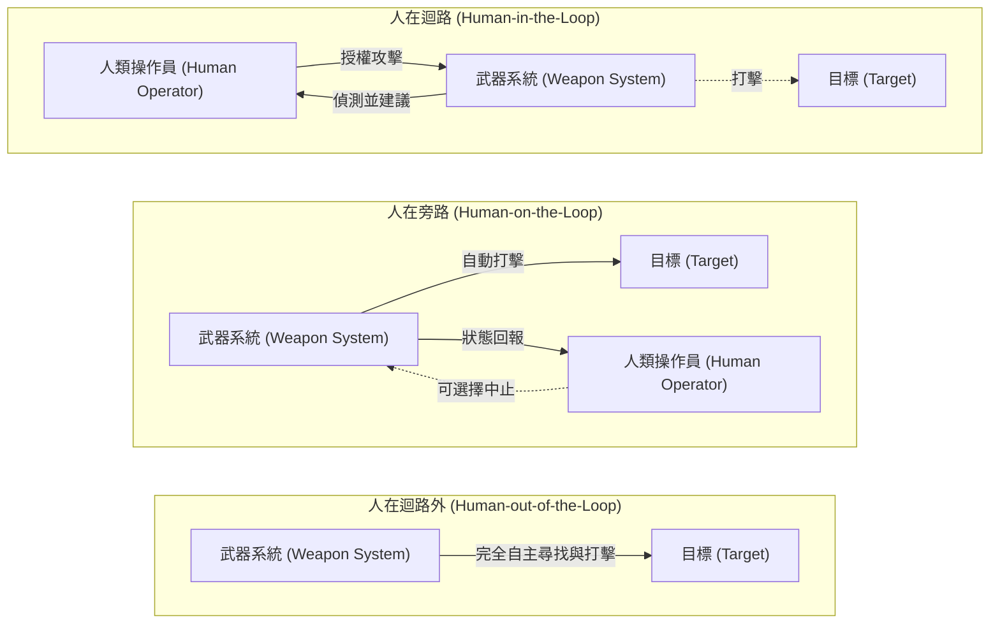
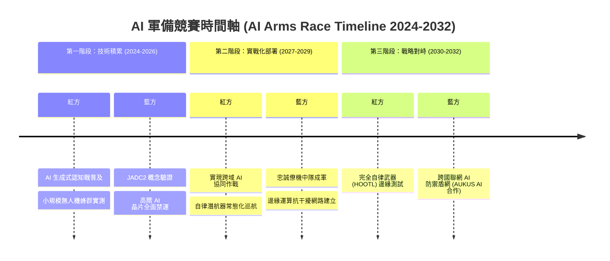
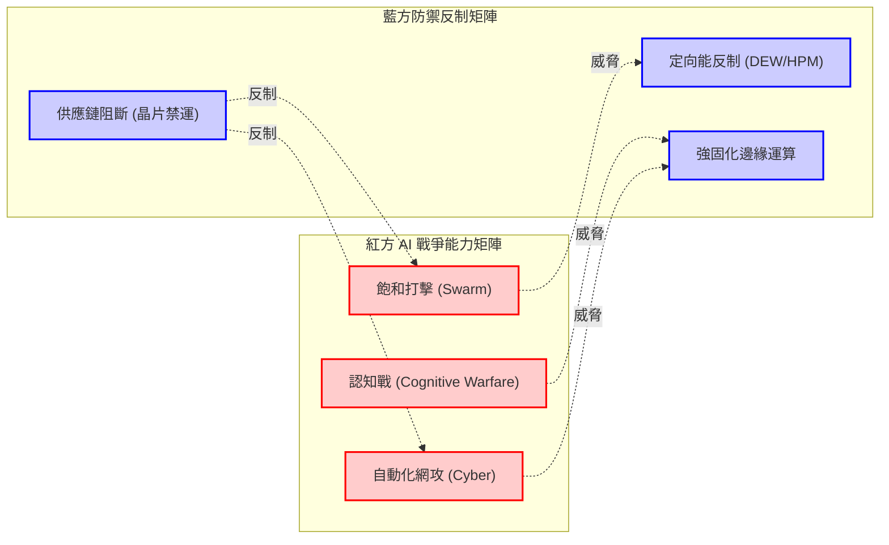

# 專題研究：AI與自律武器戰爭_紅藍方攻防分析（AI and Autonomous Weapons Warfare: Red/Blue Team Offense and Defense Analysis）

> **防禦研究聲明（Defense Research Disclaimer）**
> 本報告為專業軍事防禦與地緣政治研究之產物。報告內容涵蓋紅方（Red Team，即威脅方，指中華人民共和國及中國人民解放軍）及藍方（Blue Team，即防禦方）之戰略、戰術、軍事部署與政策推演。內容基於公開來源情報（OSINT）、軍事學理、想定推演及防禦架構分析，旨在提供決策輔助與防衛能量評估。所有推演情境均為學術與戰略研究用途，不代表任何特定國家或組織之官方政策或實際軍事行動。

## 1. 情境概述與推演背景（Scenario Overview and Wargame Background）

### 1.1 AI 在現代戰爭中的角色演變（Evolution of AI's Role in Modern Warfare）
人工智慧（Artificial Intelligence, AI）正以指數級速度改變現代戰爭的面貌。從早期單純的自動化武器（Automated Weapons）到具備深度學習與神經網路的自律系統，AI 在戰場上的角色已由「輔助工具」演變為「核心決策與執行節點」。當前，軍事 AI 的應用範疇涵蓋了情報分析、指管通情（Command, Control, Communications, Computers, Intelligence, Surveillance and Reconnaissance, C4ISR）、後勤補給、網路戰及直接動能打擊。這種技術範式的轉移，標誌著戰爭型態正從「信息化戰爭（Informationized Warfare）」向「智能化戰爭（Intelligentized Warfare）」過渡。

### 1.2 自律致命武器系統的定義與分類（Definition and Classification of LAWS）
自律致命武器系統（Lethal Autonomous Weapons Systems, LAWS）是指一旦啟動，便能在無需人類干預的情況下，自行尋找、識別、追蹤並攻擊目標的武器系統。依據人類介入決策的程度，LAWS 可分為三個層次（如圖所示）：
1. **人在迴路（Human-in-the-Loop, HITL）**：系統提出建議，人類操作員確認後才執行攻擊（半自律）。
2. **人在旁路（Human-on-the-Loop, HOTL）**：系統可自動執行攻擊，但人類操作員具有監督權與隨時中止權（人類監督自律）。
3. **人在迴路外（Human-out-of-the-Loop, HOOTL）**：系統完全自主決策與執行，人類無法干預或中止（完全自律）。

### 1.3 當前各國 AI 軍事化發展概況（Global AI Militarization Overview）
- **中國（紅方）**：將「智能化」寫入軍事發展戰略，致力於無人機蜂群、AI 輔助決策及高超音速武器的智能化導引。其優勢在於龐大的數據庫、軍民融合（Civil-Military Integration, CMI）政策，以及缺乏西方的倫理限制。
- **美國（藍方主導）**：推動「第三次抵消戰略（Third Offset Strategy）」，專注於人機協同（Human-Machine Teaming, HMT）、聯合全域指揮與控制（Joint All-Domain Command and Control, JADC2）及分散式殺傷力。
- **俄羅斯**：重點發展無人地面載具（Unmanned Ground Vehicle, UGV）與自律水下核魚雷。
- **以色列**：在實戰中廣泛應用 AI 用於目標生成及遊蕩彈藥（Loitering Munitions）。

## 2. 紅方 AI 戰爭能力分析（Red Team AI Warfare Capabilities）

### 2.1 PLA 的 AI 戰略布局（Intelligentized Warfare）
中國人民解放軍（PLA）的軍事學說已確立「智能化戰爭」為未來作戰的主要型態。紅方的戰略目標是透過「演算法戰（Algorithmic Warfare）」在「OODA 循環（觀察、導向、決定、行動）」的反應速度上超越藍方。智能化戰爭強調以大數據、機器學習（Machine Learning）與雲端計算為基礎，打破軍種壁壘，實現從戰略指揮到戰術執行端的高度協同。

近期 PLA 進行了多次以 AI 為核心的軍事演習。例如在東部戰區的兵推中，廣泛應用了 AI 目標分配系統，將傳統需要數小時的人工標定縮短至數分鐘。在無人載具協同方面，也公開展示過數十架至上百架固定翼無人機的編隊演練。

在這些發展背後，軍民融合（Military-Civil Fusion, MCF）戰略扮演了關鍵推手。紅方透過法律與政策，將商用 AI 技術（如影像辨識、自然語言處理、自動駕駛）無縫轉移至軍事用途。例如，國內的商用無人機龍頭企業技術被迅速轉化為戰術級蜂群偵察能力，而民間巨頭的人臉辨識與數據分析平台也被應用於情報蒐集與目標追蹤（ISR），極大地加速了紅方 AI 軍事化的進程。

### 2.2 無人機蜂群（Drone Swarm）作戰能力
紅方積極研發基於 AI 協同演算法的無人機蜂群戰術。這種戰術不僅限於空中，還包括水面（USV）與水下（UUV）的跨域協同。此戰術在《臺灣紅方第二卷（軍事壓迫）》中被描述為對藍方防禦縱深的重大威脅。
- **飽和攻擊（Saturation Attack）**：利用大量低成本自死式無人機（Kamikaze Drones）消耗藍方的高價值防空飛彈。
- **自癒能力（Self-healing Swarms）**：當蜂群中部分節點被摧毀時，AI 網狀網路（Mesh Network）能自動重新分配任務。

### 2.3 AI 輔助指管（AI-Augmented C2）與戰場決策加速
紅方正試圖建立以 AI 為核心的聯合作戰指揮系統，克服人類指揮官在資訊過載（Information Overload）下的決策瓶頸。

### 2.4 自律水下無人載具（Autonomous Underwater Vehicles, AUV）
在南海及西太平洋，紅方部署了具備高度自律性的 AUV，用於水文偵測、潛艦追蹤及水下基礎設施的破壞。

### 2.5 AI 驅動的認知戰與深偽（Deepfake）作戰
如同《中國紅方第二卷（軍事牽制）》所強調，紅方廣泛利用生成式 AI（Generative AI）製造深偽影片與虛假訊息。其目標是破壞藍方社會凝聚力，這是一種典型的灰色地帶戰術（Gray Zone Tactics）。

### 2.6 AI 網路攻擊自動化（Automated Cyber Warfare）
紅方利用 AI 自動探測藍方關鍵基礎設施的零日漏洞（Zero-day Vulnerabilities）。結合《48 小時快速想定》中的 EMP/電子戰內容，紅方的 AI 網攻與物理破壞形成協同的「癱瘓戰」模式。

## 3. 藍方防禦與反制框架（Blue Team Defense Framework）

### 3.1 反無人機蜂群技術（Counter-Swarm Technologies）
為應對紅方的飽和攻擊，藍方正積極部署與升級各種反無人機（C-UAS）系統：
- **具體系統應用**：美軍的「低慢小防禦系統」（M-LIDS）結合了雷達、光電感測器、電子戰干擾以及車載鏈砲，能夠有效攔截戰術無人機。以色列的「鐵穹（Iron Dome）」系統也已完成針對無人機的模式升級，其 AI 演算法能精準區分來襲的無人機與飛彈，甚至能預測蜂群的飛行軌跡，再由攔截彈執行多目標攔截。
- **高功率微波（High-Power Microwave, HPM）**：例如美軍的 THOR（戰術高功率作戰響應系統），能發射高能微波束，瞬間燒毀整群無人機的電子零件。
- **定向能武器（Directed Energy Weapons, DEW）**：如高能雷射，提供極低的單發成本（Cost per Kill），適用於長時間的抗擊。

### 3.2 AI 防禦系統（AI-Enabled Defense Systems）
藍方利用 AI 強化飛彈防禦系統，進行自動化的抗干擾切換（Cognitive Electronic Warfare）。

### 3.3 人機協同（Human-Machine Teaming, HMT）決策架構
藍方強調保留人類指揮官的戰略主導權。代表性計畫為由有人駕駛戰機指揮多架無人戰鬥機的「忠誠僚機（Loyal Wingman）」。

### 3.4 AI 倫理約束與交戰規則（Rules of Engagement, ROE）
藍方在部署 LAWS 時必須確保武器系統符合《武裝衝突法》（Law of Armed Conflict, LOAC），如美國國防部 3000.09 指令即明確規範自主武器的開發與使用。然而，在實際戰場上，這種倫理約束會面臨巨大挑戰：
- **挑戰案例 1**：當藍方的半自律系統遇到紅方完全自律且以極速發動攻擊的蜂群時，若仍堅持「人在迴路」的逐一確認，將會錯失攔截時機導致陣地覆滅。
- **挑戰案例 2**：在城市戰環境中，紅方無人系統可能利用平民作為掩護，若藍方 AI 無法百分之百精確辨識武裝人員與平民，因倫理演算法的鎖定，藍方武器可能自動拒絕開火，反而讓防禦部隊暴露於致命威脅中。這些困境要求藍方不斷調整「有意義的人類控制」在極端交戰環境下的具體標準。

### 3.5 電磁戰與反 AI 干擾
誠如《48 小時快速想定》指出，為應對 EMP 打擊，藍方正發展強固化邊緣運算（Ruggedized Edge Computing）。

### 3.6 算力與 AI 晶片供應鏈安全
實施嚴格的出口管制（Export Controls）是藍方限制紅方軍事 AI 發展的核心戰略。

## 4. 印太區域 AI 軍備競賽情境推演（Indo-Pacific AI Arms Race Scenario Wargaming）

### 4.1 2027-2030 AI 戰爭能力演變預測

### 4.2 臺海衝突中的 AI 武器運用情境推演
若紅方對臺發動武力侵犯，依據《臺灣紅方第二卷（軍事壓迫）》與《中國紅方第二卷（軍事牽制）》的推演，結合 AI 武器的投入，衝突時間軸預測如下：
- **T-24h 潛伏期（灰色地帶升級）**：紅方的 AI 認知戰系統開始大量生成深偽影片，模擬藍方高層發表投降或矛盾聲明；同時，AI 自動化網攻啟動，針對藍方關鍵網路與電網植入惡意程式，進入潛伏。
- **T+0h 攻擊發起（癱瘓戰啟動）**：紅方利用 AI 系統同步觸發網攻與物理打擊，自動分配數千枚飛彈與長程火箭彈的打擊排序，優先摧毀藍方的雷達與防空陣地。
- **T+4h 蜂群洗地**：在首波飛彈過後，紅方釋放數以萬計的自殺式無人機蜂群。這些蜂群以 AI 網狀網路相互連結，自動尋找剩餘的藍方機動防空系統（如愛國者、天弓飛彈車）進行飽和攻擊。
- **T+12h 藍方 AI 防禦啟動**：藍方啟動去中心化的 AI 備援指管系統，利用強固化邊緣運算整合殘存的感測器。無人機反制系統（如 HPM 和雷射）在 AI 輔助下，於陣地周邊建立防禦屏障，自動排定對紅方蜂群的接戰順序。
- **T+24h 忠誠僚機與無人潛航器投入**：藍方的戰機帶領「忠誠僚機」無人戰機升空，於防區外發射反輻射飛彈獵殺紅方海空目標。同時，藍方的自律水下無人載具（UUV）在臺灣海峽深水區自動布放智慧水雷，阻斷紅方兩棲船團的航線。
- **T+48h 戰場膠著與 AI 適應**：雙方的 AI 系統開始在戰鬥中進行機器學習，紅方無人機嘗試改變飛行模式以避開微波干擾，藍方 AI 則即時解析新的敵對戰術並更新電子戰參數。戰場進入高度依賴演算法對抗的「Hyperwar」階段。

## 5. AI 武器國際治理與風險（AI Weapons International Governance and Risks）

### 5.1 《特定常規武器公約》（CCW）AI 武器議題
聯合國 CCW 框架下已多次討論 LAWS 的管制，但由於各國對「有意義的人類控制（Meaningful Human Control, MHC）」定義存在嚴重分歧，導致實質性的國際條約難以成形：
- **藍方（美國等西方國家）**：主張以自願性行為準則（Code of Conduct）或政治宣言來規範 AI 武器，強調現有的《武裝衝突法》足以涵蓋 LAWS，不需建立具法律約束力的全面禁令。
- **紅方（中國）**：在外交場合曾表態支持禁止使用完全自主的致命武器系統，但對其定義極為狹隘（例如，必須是完全不接受任何人類指令的系統）。此外，紅方反對將研發（R&D）納入禁令，這為其持續發展 AI 武器保留了極大的戰略彈性。
- **俄羅斯**：堅決反對任何對自主武器的禁令或強制性國際規範，認為這會阻礙其技術發展，並主張完全自主化是軍事現代化的必經之路。
- **不結盟運動國家與非政府組織**：強烈要求制定具有法律約束力的國際條約，全面禁止任何無法保證人類控制的致命武器，擔憂這類武器會降低戰爭門檻。

### 5.2 AI 武器造成的升級風險（Escalation Risk）
AI 演算法間的非預期交互作用可能引發「閃電戰升級（Flash Escalation）」。

### 5.3 算法偏差（Algorithmic Bias）與誤判風險
數據汙染（Data Poisoning）可能導致嚴重的友軍誤擊（Fratricide）。

### 5.4 AI 軍備控制的可行性評估
未來的軍控需轉向對「運算資源（Compute）」及「數據存取」的監管。

## 6. 政策建議與戰略意涵（Policy Recommendations and Strategic Implications）

1. **強化硬殺與軟殺的混合防禦網**：加速列裝定向能武器（DEW）。
2. **分散式與強固化的 C4ISR 架構**：建立具備自癒能力的去中心化通訊。
3. **維持 AI 晶片優勢**：持續收緊對紅方獲取先進半導體的限制。
4. **設立危機溝通熱線**：雙方需建立獨立的直接決策者溝通管道以防止意外升級。
