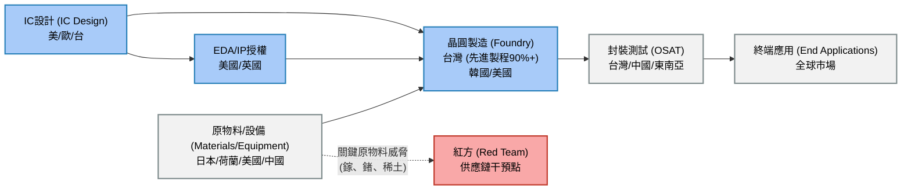
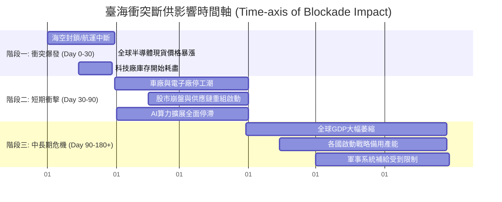
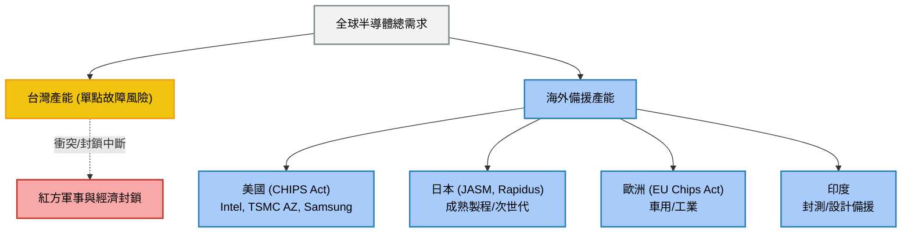

> **Defense Research Disclaimer（防禦研究聲明）**
> 本報告為專業軍事防禦與地緣政治研究，旨在探討亞太地區潛在衝突之兵棋推演（Wargaming）與戰略架構分析。內容提及之紅方（Red Team，中華人民共和國及中國人民解放軍）、藍方（Blue Team，防禦方，包含台灣及盟國）及情境推演，均屬基於公開資料與戰略推演理論之研究假設。本報告無意針對特定實體發布具體威脅，亦非對現實軍事行動之預測，僅供學術研究、國防政策規畫與供應鏈安全評估參考。

# 專題研究：半導體供應鏈安全與製程中斷之全球影響（Semiconductor Supply Chain Security and Global Impacts of Manufacturing Disruptions）

## 1. 半導體供應鏈戰略地位（Strategic Position of Semiconductor Supply Chain）

半導體已成為當代全球經濟運作與國家安全的基石。在數位化、人工智慧（AI）與軍事現代化浪潮中，半導體供應鏈（Semiconductor Supply Chain）的穩定與否直接牽動全球權力格局。本節深入分析全球半導體產業的結構及其在地緣政治上的戰略意涵。

### 1.1 全球半導體產業結構（Global Semiconductor Industry Structure）

半導體產業鏈高度全球化與專業分工，主要可分為四大環節：設計（Design）、製造（Manufacturing/Foundry）、封裝測試（Packaging and Testing）、及終端應用（End-use Application）。
*   **設計（Design）**：由無晶圓廠（Fabless）公司如 NVIDIA、AMD、Qualcomm 主導，主要集中於美國，掌握核心架構（如 ARM、x86）與電子設計自動化（Electronic Design Automation, EDA）軟體。
*   **製造（Manufacturing）**：屬於資本與技術雙密集領域。晶圓代工（Foundry）模式由台灣台積電（TSMC）首創，目前全球先進製程高度集中於台灣及韓國。
*   **封裝測試（OSAT）**：將完成的晶片進行封裝與功能測試，主要分布於台灣、中國與東南亞。
*   **終端應用（Application）**：涵蓋消費性電子、車用電子、工業控制、高效能運算（High Performance Computing, HPC）及軍用設備。

### 1.2 臺灣在全球半導體供應鏈中的關鍵角色

台灣，尤其是台積電（TSMC），在全球供應鏈中扮演不可替代的角色。根據市場調查，台灣掌握了全球約 60% 的晶圓代工市占率，若縮小至 7 奈米（nm）以下的先進製程（Advanced Nodes），台灣的市占率更超過 90%。
這種極端集中導致全球對台灣的單一節點依賴（Single-point Dependency）。從蘋果（Apple）的智慧型手機到美國國防部（DoD）的軍事系統，幾乎所有頂尖科技均仰賴台灣製造的晶片。台灣藍方在關鍵基礎設施與數位韌性上的維持（參見《台灣藍方（關鍵基礎設施與數位韌性）》報告），是確保全球科技運轉的核心前提。

### 1.3 「矽盾」（Silicon Shield）理論與其局限性

「矽盾」理論主張，台灣在全球半導體供應鏈的樞紐地位，使得任何對台動武的舉動都會導致全球經濟災難，進而嚇阻紅方（中華人民共和國/中國人民解放軍）的武力犯台意圖，同時確保美國及其盟友必須介入防衛台灣。
然而，此理論存在局限性：
1.  **戰略優先性差異**：紅方可能將「統一」的政治與民族主義目標置於經濟損失之上。
2.  **供應鏈重組**：隨各國推動半導體在地化，矽盾的防禦效力可能隨時間遞減。
3.  **基礎設施脆弱性**：半導體廠區對水、電、網路依賴極高，極易成為灰色地帶戰術（Gray Zone Tactics）與網路攻擊的目標。

### 1.4 半導體供應鏈的地緣政治化（Geopoliticization）

半導體已從純粹的商業產品轉化為大國博弈的核心籌碼。美國推動的「小院高牆」（Small Yard, High Fence）策略，試圖透過出口管制（Export Controls）限制紅方取得先進晶片及製造設備（如 EUV 曝光機）。作為回應，紅方加速推動「自主可控」戰略，並利用其在關鍵礦物上的優勢進行反制。此領域已完全地緣政治化。

---

## 2. 紅方威脅與經濟戰情境（Red Team Threat Scenarios）

紅方針對台灣及全球半導體供應鏈的威脅不僅限於傳統的兩棲登陸，更包含多元的經濟戰（Economic Warfare）與非對稱作戰（Asymmetric Warfare）手段。

### 2.1 軍事衝突導致的製程直接中斷

若台海爆發武裝衝突，無論是全面入侵或局部封鎖，台灣的半導體生產將立即中斷。半導體製程對震動、粉塵及電力供應極為敏感。飛彈攻擊引發的微震動、電網癱瘓或空域海域封鎖導致的原物料斷供，都會在數天甚至數小時內讓晶圓廠停擺。一旦無塵室（Cleanroom）環境被破壞，正在生產線上的晶圓（WIP）將全部報廢。

### 2.2 稀土與特殊氣體封鎖（氖氣 Neon、六氟化鎢 WF6、光阻劑）

紅方可能發動資源戰。如同《情境劇本_稀土半導體封鎖與金融戰》所分析，紅方在全球稀土金屬（Rare Earth Elements）提煉及特定化學氣體市場占有主導地位。
*   **氖氣（Neon）**：用於 DUV 曝光機的雷射氣體。
*   **六氟化鎢（WF6）**：用於化學氣相沉積（CVD）。
*   若紅方聯合其他國家或單方面進行禁運，將嚴重打擊藍方及盟國的半導體製造能力。

### 2.3 針對性制裁與出口管制反制（中國限制鎵 Gallium、鍺 Germanium 出口）

作為對西方科技圍堵的反擊，紅方已開始實施出口管制。例如，對鎵（Gallium）和鍺（Germanium）的出口限制，這兩種金屬是製造第三代半導體（如碳化矽 SiC、氮化鎵 GaN，廣泛用於雷達與電動車）及光纖通信的關鍵原料。紅方透過此類手段展示其切斷全球科技供應鏈底層材料的能力。

### 2.4 紅方對臺灣半導體設施的軍事打擊目標分析

在武力犯台情境下，紅方對台灣半導體設施的態度存在矛盾：一方面希望完整接收以助益自身科技發展；另一方面，若確認無法奪取，可能選擇將其摧毀以打擊全球經濟與西方軍事實力（詳見《中國紅方第三卷（經濟安全與基礎設施）》）。
打擊目標（Targeting Analysis）可能包含：
*   **竹科、中科、南科**的超高壓變電所（EHV Substations），達成「斷電即斷產」。
*   供水系統與專管設施。
*   海底電纜登陸站，切斷台灣與國際設計團隊的指管通情（C4ISR）及資料傳輸。

### 2.5 人才竊取與技術間諜（Talent Poaching & Industrial Espionage）

紅方長期透過高薪挖角台灣與韓國的半導體工程師，並利用合資企業、殼公司或網路間諜活動竊取商業機密與技術參數。此灰色地帶戰術在衝突爆發前即持續削弱藍方的技術壁壘。

### 2.6 紅方自主半導體發展進程（中芯國際 SMIC、華為海思）

儘管受制裁，紅方仍傾舉國體制推動「大基金」支持半導體。中芯國際（SMIC）利用多重曝光（Multi-patterning）技術，成功為華為海思（HiSilicon）生產 7nm 等級晶片。紅方正積極建立不依賴西方的「紅色供應鏈」，一旦其在成熟製程（Legacy Nodes）取得壟斷優勢，將對全球物聯網（IoT）與車用晶片市場形成另一種脅迫能力。

---

## 3. 全球影響連鎖分析（Global Impact Chain Analysis）

台灣半導體產能中斷將引發史無前例的全球供應鏈崩潰，其衝擊規模遠超 COVID-19 疫情期間的晶片荒。

### 3.1 汽車產業衝擊（Vehicle Production Disruption）

現代汽車（尤其是電動車 EV）搭載數千顆微控制器（MCU）、電源管理晶片（PMIC）與感測器。一旦斷供，全球主要車廠（如豐田、福斯、福特）將在 2-4 週內耗盡庫存，導致工廠全面停工。全球汽車產量將面臨腰斬，造成數百萬產業勞工失業。

### 3.2 消費電子產品供給危機

智慧型手機、個人電腦、遊戲主機等產品依賴台灣的先進製程晶片。中斷將導致蘋果、三星等巨頭無法推出新產品。現有庫存將迅速枯竭，導致電子產品價格暴漲，並嚴重影響全球通訊與商業活動。

### 3.3 AI 算力基礎設施影響（GPU/AI 晶片斷供）

AI 革命高度依賴如 NVIDIA H100/B200 等高階 GPU，這些晶片幾乎完全由台積電代工並使用其先進封裝（CoWoS）技術。製程中斷將徹底凍結全球 AI 算力擴張，打斷歐美科技巨頭的 AI 軍備競賽與雲端運算升級。

### 3.4 軍事武器系統晶片供應（F-35、精確導引武器）

現代武器系統高度晶片化。美國的 F-35 戰鬥機、標槍飛彈（Javelin）、愛國者防空系統等皆需大量高可靠性半導體。儘管軍規晶片多為成熟製程，且部分具備在地產能，但二級、三級供應商的零組件仍高度依賴亞洲。斷供將削弱盟軍補充精確導引武器（Precision-Guided Munitions, PGM）庫存的能力。

### 3.5 全球 GDP 損失估算（多種情境模型）

根據不同智庫模型，台海衝突導致的斷供將造成：
*   **短期（首年）**：全球 GDP 損失可能達 2 兆至 5 兆美元，佔全球 GDP 約 2%-5%。
*   **長期（3-5年）**：在替代產能建立前，技術倒退與通膨將使全球經濟陷入長期停滯（Stagflation）。

### 3.6 金融市場連鎖反應

半導體中斷將引發科技股崩盤，進而波及納斯達克（Nasdaq）與全球主要指數。避險情緒飆升將導致資本流出新興市場，引發流動性危機，形成全面的金融戰與市場恐慌。

---

## 4. 供應鏈韌性與分散策略（Supply Chain Resilience）

為應對單一節點風險，各國正加速實施供應鏈多元化與「友岸外包」（Friend-shoring）。

### 4.1 美國 CHIPS Act 與在地製造（Arizona/Ohio 新廠）

美國透過《晶片與科學法案》（CHIPS and Science Act）提供 527 億美元補貼，吸引 TSMC、Intel、Samsung 於美國本土（如亞利桑那州、俄亥俄州）設廠。旨在確保極端情況下，美國本土具備先進製程的最低限度自主生產能力。

### 4.2 日本半導體復興計畫（JASM/Rapidus）

日本政府積極提供巨額補貼邀請 TSMC 於熊本設立 JASM 廠（主攻成熟製程與車用晶片），並成立國產國家隊 Rapidus，試圖在 2nm 製程彎道超車，恢復其半導體大國地位。

### 4.3 歐盟 European Chips Act

歐盟《晶片法案》目標在 2030 年將歐洲在全球半導體製造市占率提升至 20%。主要吸引 Intel 與 TSMC 於德國設廠，著重於汽車及工業自動化所需的成熟與次先進製程。

### 4.4 印度半導體發展計畫

印度祭出百億美元補貼，試圖建立半導體生態系。目前以封測廠（如塔塔集團與力積電合作）為先導，長遠目標是成為全球供應鏈的備援基地。

### 4.5 供應鏈多元化的時間與成本評估

建立晶圓廠需時 3-5 年，且面臨嚴峻挑戰：
*   **成本高昂**：美國建廠成本約為台灣的 2-3 倍。
*   **人才短缺**：歐美缺乏具備輪班文化且經驗豐富的半導體製程工程師。
*   **生態系匱乏**：台灣的競爭力來自高度集中的供應商聚落，這在海外難以迅速複製。

### 4.6 關鍵物料戰略儲備

各國亦開始針對矽晶圓、光阻劑、特種氣體等進行戰略儲備（Strategic Reserves），以應對紅方可能發動的物料禁運。

---

## 5. 臺海衝突情境下的半導體斷供推演

以下針對紅方發起不同強度行動時，半導體斷供的時間軸與影響進行兵推演練。

### 5.1 情境一：封鎖導致出貨中斷（30天、90天、180天影響）
*   **30天內**：海運中斷導致矽晶圓與化學品無法輸入，空運中斷導致晶片無法輸出。IC 設計公司股價暴跌，全球現貨市場出現恐慌性囤貨。
*   **90天內**：多數下游廠商的 45-60 天安全庫存耗盡。汽車生產線大規模停工，消費性電子產品斷貨。
*   **180天以上**：全球經濟進入衰退。AI 發展停滯，通訊基礎設施無法更新。紅方若趁機利用其成熟製程傾銷，可能以此逼迫中立國妥協。

### 5.2 情境二：設施遭精確打擊損毀
若紅方使用彈道飛彈或破壞小組精確打擊（Precision Strike）晶圓廠設施。由於復原受損的無塵室與精密設備（如 EUV）需要 1-2 年以上，此情境將宣告全球先進製程能力實質「歸零」。全球科技發展將被迫倒退 5-10 年，直至美日歐新廠具備量產能力。

### 5.3 情境三：TSMC「焦土策略」（Scorched Silicon）可行性
美國學界曾提出「焦土策略」，即在台灣淪陷前主動摧毀台積電設施，防止紅方取得先進技術。
*   **實務操作性**：TSMC 設備（特別是 ASML 的 EUV）具備遠端鎖定功能（Remote Kill Switch）。無須物理炸毀，只要切斷原廠授權密碼與軟體更新，設備即變為廢鐵。
*   **戰略意義**：這將徹底打消紅方「以戰養技」的企圖，但同時也會讓台灣失去戰後重建經濟的最大籌碼。

### 5.4 各國替代產能啟動時間線
即使美日歐新廠已建立，要填補台灣產能缺口仍極度困難：
*   **產能規模**：海外廠產能僅占台積電總產能 10-15%。
*   **良率爬坡（Yield Ramp-up）**：在新廠達到符合商業標準的良率需耗時 1-2 年。
*   替代方案架構如下圖所示。

---

## 6. 政策建議與戰略意涵（Policy Recommendations and Strategic Implications）

面對紅方日益增加的威脅，藍方與全球盟友必須採取系統性的應對措施。

### 6.1 臺灣半導體安全保障措施
1.  **關鍵基礎設施防護（CIP）加固**：提升水、電、通訊（含星鏈等低軌衛星通訊）的抗打擊與備援能力。
2.  **實體與資訊反間諜**：強化營業秘密保護法，防範紅方人員滲透與網路攻擊。
3.  **戰略儲備建立**：政府與企業協同建立至少 6 個月以上的關鍵化學品與特種氣體戰備儲存槽。

### 6.2 盟國協同供應鏈安全框架
1.  **科技北約（Tech-NATO）**：美、日、台、韓應建立「晶片四方聯盟（Chip 4）」的實質危機應變機制。當台海危機發生時，確保設備供應商（如荷蘭 ASML、日本信越化學）能迅速配合管制。
2.  **分散式生產網路**：承認台灣無可取代的同時，有計畫地在美、日建立具備 100% 技術備份與最低限度產能的「鏡像工廠」。

### 6.3 半導體供應鏈作為外交籌碼
1.  **清晰的嚇阻訊息**：西方盟國必須向紅方明確傳達，任何對台灣的軍事行動都將觸發最嚴厲的半導體與經濟制裁，並確保紅方無法接收完整運作的晶圓廠。
2.  **整合型經濟戰略**：將半導體出口管制與金融制裁（如 SWIFT 剔除）結合，形成多領域、跨部門的戰略威懾體系。

## 結論

半導體供應鏈的脆弱性是全球地緣政治的「阿基里斯腱」。台灣的戰略價值與風險並存，製程中斷不僅是台灣生存的危機，更是全球經濟與科技發展的災難。藍方陣營必須在「維持台灣核心優勢」與「建立全球韌性備援」之間取得動態平衡，以應對紅方未來可能發起的全面或混合型挑戰。
