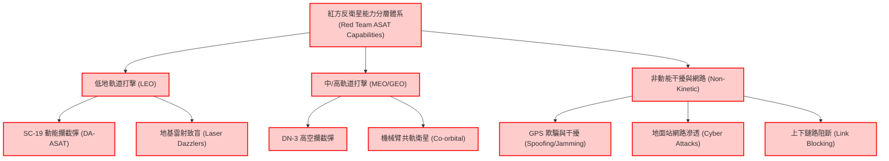
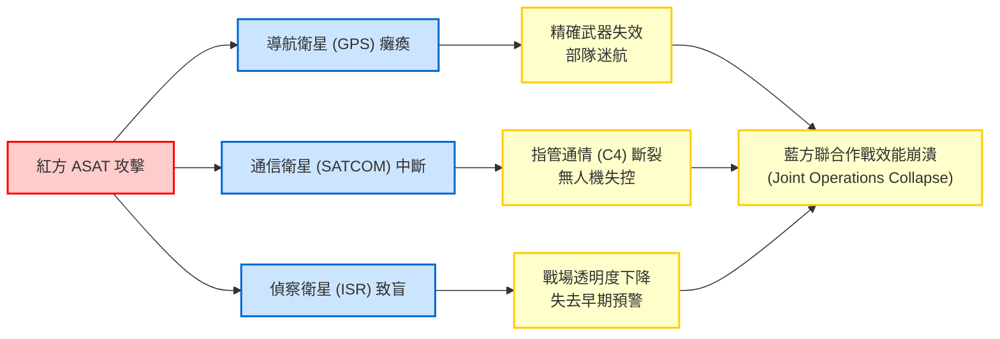
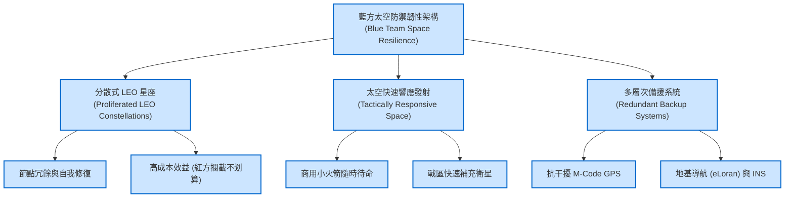

> [!NOTE]
> **Defense Research Disclaimer / 防禦研究聲明**
> 本文件為軍事防禦與地緣政治之兵推（Wargaming）專題研究報告。內容基於公開來源情報（OSINT）、現有防禦理論與情境推演撰寫，不代表任何官方立場。文件內所述之「紅方（Red Team）」代表潛在威脅或攻擊方（本專案中特指中華人民共和國及中國人民解放軍），「藍方（Blue Team）」代表防禦或友軍方。內容僅供學術研究、戰略規劃與防衛安全分析之用。

# 專題研究：太空與衛星安全_反衛星與通信切斷（Space and Satellite Security: Anti-Satellite and Communication Cutoff）

## 1. 太空安全戰略背景（Strategic Background of Space Security）

### 1.1 太空作為第五作戰領域（Fifth Domain of Warfare）
隨著科技與軍事理論的演進，太空已經正式成為繼陸、海、空、網路之後的「第五作戰領域（Fifth Domain of Warfare）」。現代戰爭高度依賴太空資產來遂行指管通情（Command, Control, Communications, Computers, Intelligence, Surveillance and Reconnaissance, C4ISR）。在此一作戰領域中，任何一方若能奪取「制天權（Space Superiority）」，將對地球表面的聯合作戰產生決定性的影響。紅方（Red Team）將太空視為現代戰爭中的「高地」，並積極發展非對稱戰力以期在衝突初期即剝奪藍方（Blue Team）的太空優勢。

### 1.2 軍事衛星系統分類
在軍事應用上，衛星系統主要分為四大類別，每一類別皆是現代軍隊遂行作戰的關鍵節點：
- **通信衛星（Communication Satellites）**：提供全球、超視距（BVLOS）的保密通信能力，確保指管通情系統的連貫性。
- **偵察與監視衛星（ISR Satellites）**：包括光學、雷達（如合成孔徑雷達 SAR）及電子情報（ELINT）衛星，用於戰場透明化與目標獲取。
- **導航與定位衛星（Navigation Satellites）**：如美國的全球定位系統（GPS）與紅方的北斗衛星導航系統（BDS），為精確導引武器（Precision-Guided Munitions, PGM）與部隊機動提供定位、導航與授時（Positioning, Navigation, and Timing, PNT）服務。
- **飛彈預警衛星（Missile Warning Satellites）**：透過紅外線傳感器探測彈道飛彈發射時的高溫尾焰，提供戰略預警。

### 1.3 印太區域太空態勢感知（Space Situational Awareness, SSA）
太空態勢感知（SSA）是太空防禦的基礎。印太區域由於地緣政治的複雜性，藍方在此區域正積極建構綿密的 SSA 網絡，透過地基雷達、光學望遠鏡及天基傳感器，持續追蹤在軌衛星與太空碎片（Space Debris）的動態。準確的 SSA 能夠提供早期預警，判斷紅方衛星是否有異常的共軌接近行為或潛在的敵意操作。

### 1.4 太空軍事化現狀
當前，太空軍事化已成為不可逆的趨勢。藍方主要領導國（美國）於 2019 年正式成立美國太空軍（U.S. Space Force），將太空作戰獨立建軍。紅方則透過軍改，原成立戰略支援部隊（Strategic Support Force, SSF）統籌太空與網路電子戰力；近期更進一步改組成立「信息支援部隊（Information Support Force）」，以及相應的天軍體系，顯示紅方正高度整合太空戰、網路戰與電子戰（Space, Cyber, and Electronic Warfare），企圖以一體化的方式癱瘓藍方的指管通情網路。

---

## 2. 紅方反衛星能力分析（Red Team ASAT Capabilities）

紅方為抵消藍方的傳統軍事優勢，積極發展「反衛星（Anti-Satellite, ASAT）」武器。其能力涵蓋從地表到太空、從動能到非動能的多層次打擊手段，形成了所謂的「反介入/區域拒止（A2/AD）」在太空領域的延伸。

### 2.1 動能反衛星武器（Kinetic Kill Vehicle, KKV）
紅方擁有成熟的直接上升式反衛星（Direct-Ascent ASAT, DA-ASAT）能力。其 SC-19 及 DN-3 等動能攔截彈，能夠從地面機動發射車或水面艦艇發射，以高速物理撞擊的方式摧毀低地軌道（LEO）的藍方衛星。近年來，紅方的測試表明其具備威脅中軌道（MEO）甚至地球同步軌道（GEO）衛星的潛力。

### 2.2 共軌反衛星（Co-orbital ASAT）
紅方積極部署具備高機動能力的微衛星或實驗衛星。這些衛星裝備有機械臂（Robotic Arms），平時宣稱為「太空碎片清除」或「在軌維護（On-orbit Servicing）」之用；戰時則可作為共軌武器，靠近並捕獲藍方高價值衛星，或是透過塗抹傳感器、折斷太陽能板等方式使其失能。這是一種典型的灰色地帶戰術（Gray Zone Tactics）。

### 2.3 定向能武器（Directed Energy Weapons, DEW）
紅方已在境內多處部署地基雷射致盲武器（Ground-based Laser Dazzlers/Blinders）。這些定向能武器能在不產生太空碎片的情況下，暫時致盲（Dazzling）或永久損壞藍方光學偵察衛星的傳感器。此外，高功率微波武器（High-Power Microwave, HPM）亦可燒毀衛星的內部電子元件。

### 2.4 電磁干擾與欺騙（Jamming & Spoofing）
電子戰是紅方破壞藍方太空資產的最常用手段。紅方具備強大的 GPS/北斗干擾能力，能在大範圍內遮蔽衛星信號（Jamming），或發送虛假定位信號（Spoofing），導致藍方部隊迷航及精確導引武器失效。（*參考：《48小時快速想定》中的 EMP 與電子戰段落，紅方常將電磁干擾與網路攻擊作為首波打擊手段。*）

### 2.5 網路攻擊衛星地面站（Ground Station Cyber Attack）
衛星系統並非僅存在於太空中，其地面控制站（Ground Stations）及上下鏈路（Uplink/Downlink）同樣脆弱。紅方網軍可透過網路釣魚、供應鏈攻擊等方式滲透藍方地面站，進而奪取衛星控制權或中斷數據傳輸。

### 2.6 紅方太空碎片武器化（Weaponized Space Debris）風險
紅方在 2007 年的 ASAT 測試中產生了大量太空碎片。在極端情況下，紅方可能刻意在特定軌道製造碎片雲，利用碎片的高速動能對該軌道面的所有衛星實施無差別打擊。

---

## 3. 衛星系統脆弱性評估（Satellite Vulnerability Assessment）

藍方高度依賴太空系統，這也成為其作戰體系中的阿基里斯腱。對衛星系統的成功打擊，將引發連鎖效應。

### 3.1 GPS/GNSS 依賴性與軍事影響
藍方的大量作戰裝備，從無人機（UAV）、戰機到單兵通訊設備，皆依賴 GPS 獲取 PNT 資訊。若紅方成功干擾或摧毀 GPS 衛星，將導致藍方聯合作戰失去時間同步，精確導引武器（如 JDAM、戰斧巡弋飛彈）命中率大幅下降。

### 3.2 軍事通信衛星的單點故障風險
傳統上，藍方仰賴少數大型地球同步軌道（GEO）通信衛星（如 WGS 系統）提供龐大的頻寬。這些衛星雖然昂貴且防護性較高，但一旦遭到共軌攻擊或定向能武器癱瘓，將造成廣大戰區內的通信中斷，形成單點故障（Single Point of Failure）。

### 3.3 偵察衛星失能對戰場態勢感知的影響
藍方的 ISR 衛星若被地基雷射致盲，藍方將無法即時獲取紅方部隊集結、飛彈發射車移動的情報。這將嚴重削弱藍方的「擊殺鏈（Kill Chain）」運作速度。（*參考：《中國紅方第二卷（軍事牽制）》中，紅方透過太空/電磁域的聯合遮蔽，企圖達成戰役初期的隱蔽企圖。*）

### 3.4 飛彈預警衛星的存活性
飛彈預警衛星（如 SBIRS）是藍方核威懾與飛彈防禦的基石。這些系統若遭到攻擊，極易引發戰略誤判，藍方可能無法分辨紅方發射的是常規彈道飛彈還是核武器，增加衝突升級的風險。

### 3.5 民用衛星被攻擊的附帶影響
現代衝突中，民商用衛星（如 Starlink、Maxar）大量被徵用於軍事用途。紅方攻擊這些衛星不僅影響軍事行動，更會波及全球民航、氣象預報、海事導航及國際金融交易，造成巨大的經濟附帶損害。

---

## 4. 藍方太空防禦架構（Blue Team Space Defense Architecture）

面對紅方日益增強的太空威脅，藍方正積極推推太空系統的範式轉移（Paradigm Shift），從「少數大型脆弱衛星」轉向「大量分散式韌性架構」。

### 4.1 衛星星座分散化與快速補充（Resilient Constellation）
藍方大力發展基於低軌道（LEO）的大型巨型星座（Megaconstellations，如 SDA 的 Proliferated Warfighter Space Architecture, PWSA）。這種架構包含數百至數千顆小衛星。即使紅方擊落數十顆衛星，整體網路仍能透過自我修復與路由切換保持運作，大幅提高紅方攻擊的成本。

### 4.2 太空態勢感知網絡（SSA Network）
升級全域 SSA 網絡，整合商業太空雷達資料。藍方需確保能夠在紅方發動攻擊的初期偵測到反衛星飛彈的發射，或提早預判紅方共軌衛星的異常軌道機動。

### 4.3 反干擾衛星技術（Anti-Jamming / LPI-LPD）
導入跳頻（Frequency Hopping）、指向性天線（Directional Antennas）以及低截獲率/低探測率（LPI/LPD）通信技術。配備更強大的抗干擾模組（如 M-Code GPS），以對抗紅方的強電磁壓制。

### 4.4 太空碎片清除與軌道管理
發展主動太空碎片移除技術（Active Debris Removal, ADR）。雖然主要目的為環保，但在軍事上可作為對抗紅方「碎片武器化」的防禦手段，並具備反向的在軌維護能力。

### 4.5 小衛星快速發射能力（Responsive Space Launch）
藍方需具備「太空快速響應（Tactically Responsive Space, TacRS）」能力。在衛星遭到摧毀後，能夠利用機動發射車或空射火箭，於數天甚至數小時內將替代的小衛星發射入軌，恢復關鍵的戰區通信與偵察能力。

### 4.6 地面替代系統
為防範太空系統全毀的極端情況，藍方必須保留並升級地面替代方案。例如增強型羅蘭地基導航系統（eLoran）作為 GPS 的備份，以及在軍機與船艦上普及先進的慣性導航系統（INS）與星象導航。

---

## 5. 情境推演：臺海衝突中的太空作戰（Scenario Simulation）

本節以臺海衝突為背景，推演紅方在衝突爆發前後的太空作戰階段。（*參考：《臺灣紅方第二卷（軍事壓迫）》中紅方的封鎖與孤立戰略。*）

### 5.1 T-72h：衛星偵察異常（紅方反偵察措施）
在衝突爆發前 72 小時，藍方發現其多顆通過紅方東南沿海的商業光學偵察衛星回傳之影像出現大面積白斑，研判遭到紅方地基雷射致盲。紅方藉此隱蔽其兩棲部隊的最後集結與導彈陣地的部署。

### 5.2 T+0：GPS 干擾與通信衛星攻擊
衝突爆發零時（H-Hour），紅方不僅發動實體飛彈打擊，更全面啟動太空與網路電磁戰。臺灣周邊地區遭受高強度的 GPS 干擾，紅方並可能動用網路手段攻擊藍方位於境外的衛星地面中繼站。同時，紅方的共軌衛星向藍方的一顆關鍵 GEO 預警衛星靠近，實施電磁干擾，試圖在第一波打擊中挖盲藍方的眼睛。

### 5.3 T+6h：藍方精確導引武器效能下降
由於 GPS 信號極度不穩，藍方發射的防區外精確打擊武器（如反艦飛彈）在進入末端導引前，導航誤差明顯增加。藍方被迫切換至依賴地形匹配或慣性導航，一定程度上影響了對紅方兩棲船團的打擊效率。

### 5.4 T+24h：替代導航系統啟用與太空快速響應
藍方啟動備援機制。啟用地基 eLoran 系統支援周邊艦隊導航，無人機切換至抗干擾數據鏈。藍方盟國隨即透過商業發射場，緊急發射數顆攜帶戰術通信酬載的小衛星進入軌道，以彌補戰區內被紅方壓制的頻寬。

### 5.5 太空攻擊與核升級的關聯性
推演中顯示，紅方若過度攻擊藍方的早期預警衛星，極易觸碰藍方的戰略紅線。因為預警衛星不僅用於常規戰爭，更負責監控核打擊。若藍方誤判紅方的 ASAT 攻擊為核突襲的前兆，將可能導致衝突迅速升級至核武層次。因此，紅方在實際作戰中可能更傾向於使用「可逆的（Reversible）」干擾手段（如電子壓制），而非直接動能摧毀。

---

## 6. 太空治理與國際合作（Space Governance and International Cooperation）

### 6.1 《外太空條約》的侷限
1967 年的《外太空條約》（Outer Space Treaty）雖禁止在軌道上部署核武器及大規模毀滅性武器（WMD），但對於常規反衛星武器、雷射武器及網路干擾並未明確規範。這使得太空成為一個缺乏強硬法律約束的「狂野西部（Wild West）」。

### 6.2 太空行為準則（Norms of Behavior）倡議
藍方正致力於推動負責任的太空行為準則，如呼籲各國承諾停止「破壞性直升式反衛星飛彈測試」。然而，紅方對此類倡議多持保留態度，認為這是藍方企圖固化其既有太空優勢的手段。

### 6.3 盟國太空合作
在印太區域，美國正加強與日本、澳洲等盟國的太空安全合作。例如將美方太空酬載搭載於日本的準天頂衛星系統（QZSS）上，增加架構的韌性。AUKUS 協議也正向太空領域擴展，深化三國在太空態勢感知與深太情報共享的合作。

### 6.4 太空碎片 Kessler Syndrome 的戰略風險
紅方若大規模使用動能 ASAT 武器，產生的大量碎片可能引發凱斯勒現象（Kessler Syndrome）——碎片間的連鎖撞擊將使特定軌道在未來數十年內完全無法使用。這不僅摧毀藍方的太空資產，也將導致紅方自身的衛星及全球民商用太空經濟毀於一旦。此為太空作戰中必須考量的終極戰略風險。

---

## 7. 政策建議與戰略意涵（Policy Recommendations and Strategic Implications）

1. **加速佈建低軌分散式星座**：藍方（及臺灣）應積極發展或租用基於 LEO 的分散式通訊網路（如 Starlink 模式），擺脫對單一高軌衛星的依賴。
2. **建構全域備援能力**：軍隊必須常態化演練在「無 GPS（GPS-Denied）」及「斷網」環境下的作戰能力，恢復傳統的圖上作業與星象/慣性導航技能。
3. **強化地面基礎設施防禦**：保護衛星地面接收站與海底電纜登陸站，防止紅方的特種作戰部隊或網路攻擊進行破壞。
4. **提升印太太空情報共享**：將臺灣納入區域性的太空態勢感知（SSA）情報共享機制中，使其能夠提前預警紅方的太空敵對行為及飛彈威脅。
5. **發展非對稱的反制手段**：藍方應開發針對紅方太空節點的軟殺傷（Soft-kill）手段，如電子干擾與網路駭侵，以具備對等的嚇阻能力，迫使紅方在發動太空戰時有所顧忌。

> **總結**：未來的臺海或印太衝突，首戰必在太空與電磁領域打響。確保太空資產的存活性與韌性，是藍方維繫聯合作戰效能、拒止紅方軍事冒進的關鍵基石。
