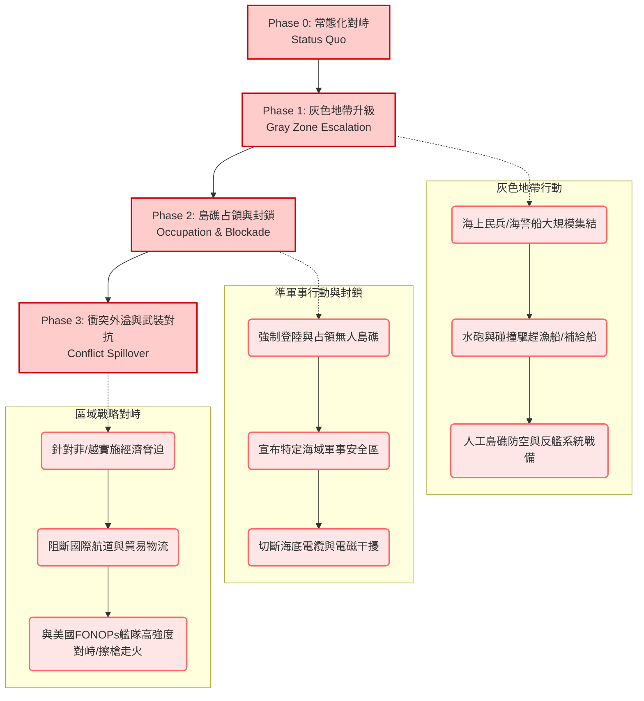

# 情境劇本：南海島礁衝突與印太聯動（South China Sea Conflict & Indo-Pacific Spillover）

> **防禦研究聲明 (Defense Research Disclaimer)**
> 本文檔為「WarOfAsia」專案之虛擬情境兵推劇本，基於防禦型紅隊（Defense-oriented Red Team）與全社會韌性藍方（Whole-of-Society Resilience Blue Team）之方法學進行兵棋推演。本文旨在學術研究與防衛分析，探討印太區域潛在衝突模式、危機升級路徑與多邊安全架構之應對，以強化區域安全意識與危機管理機制。所有情節均為基於現存地緣政治結構之推演，不代表對特定事件之預測。

---

## 1. 情境概述與推演背景 (Context and Background)

### 1.1 南海島礁爭端現狀 (Current Status of Territorial Disputes)
南海（South China Sea）作為全球最為繁忙的戰略水道之一，長期處於多國主權聲索重疊的複雜地緣政治博弈中。當前最為顯著的衝突熱點集中於**中菲仁愛礁（Second Thomas Shoal）與黃岩島（Scarborough Shoal）爭端**，以及**中越西沙群島（Paracel Islands）與南沙群島（Spratly Islands）**的歷史性對峙。
紅方（Red Team）常態化利用海上民兵（Maritime Militia）與海警（Coast Guard）實施「灰色地帶戰術」（Gray Zone Tactics），透過水砲、雷射光照射、船隻碰撞等非對稱強制手段，持續向周邊國家施加壓力。

### 1.2 南海九段線與國際仲裁 (The Nine-Dash Line and PCA 2016)
紅方主張「九段線」（Nine-Dash Line）涵蓋南海約 90% 的海域，並以此作為其歷史性權利的主張依據。2016年，常設仲裁法院（Permanent Court of Arbitration, PCA）針對菲律賓提起的南海仲裁案作出了歷史性裁決（2016 Arbitral Award），宣告九段線主張在《聯合國海洋法公約》（UNCLOS）框架下無效。然而，紅方採取「不接受、不參與、不承認」的立場，並在仲裁後加速推動南沙群島的人工島礁軍事化（Militarization of Artificial Islands），部署防空飛彈、反艦飛彈及早期預警雷達，實質改變了區域軍事平衡。

### 1.3 南海與臺海的戰略聯動性 (Strategic Linkage between SCS and Taiwan Strait)
在防衛分析中，南海與臺海（Taiwan Strait）具備高度的戰略聯動性（Strategic Linkage / Spillover Effect）。若南海爆發局部軍事衝突，將直接牽動美軍及印太盟友的兵力部署，紅方可能藉機在臺海進行戰略牽制（Strategic Diversion）；反之亦然。南海與臺海的「雙線危機」（Two-Front Crisis）成為印太區域多邊防衛架構最嚴峻的考驗。

---

## 2. 紅方攻勢情境設定 (Red Team Offensive Scenarios)

本推演採用防禦型紅隊視角，描繪紅方如何利用切香腸戰術（Salami Slicing Tactics）逐步推升區域衝突。

### 2.1 衝突升級階梯 (Escalation Ladder)

### 2.2 第一階段：灰色地帶升級 (Phase 1: Gray Zone Escalation)
- **海上民兵/海警船集結**：紅方動員數百艘漁船組成海上民兵，在海警船掩護下，於仁愛礁或黃岩島周邊形成「鐵桶陣」（Cabbage Strategy），阻斷藍方補給線。
- **針對性驅趕**：頻繁使用高壓水砲（Water Cannons）、軍用級雷射光（Military-grade Lasers）與近距離危險航行（Unsafe Maneuvers）干擾菲律賓海巡署（PCG）與越南漁政船。
- **人工島礁軍事化加速**：啟動永暑礁、美濟礁、渚碧礁等人工島嶼的防空導彈系統（HQ-9）與反艦導彈（YJ-12），對藍方空中偵巡實施火控雷達鎖定。

### 2.3 第二階段：島礁占領與海域封鎖 (Phase 2: Occupation and Blockade)
- **島礁強制占領**：趁颱風過後或區域政治動盪之際，紅方特種部隊與海巡人員強行登陸某爭議島礁（如仁愛礁坐灘軍艦），拆除或驅離留守人員。
- **軍事安全區宣告**：單方面宣布爭議海域為「軍事演習禁航區」或設立「南海防空識別區」（ADIZ），拒絕外國機艦進入。
- **基礎設施破壞**：切斷連結菲律賓、越南與國際的關鍵海底電纜（Submarine Cables），並對周邊雷達與通信節點實施電磁干擾（EW/Jamming）與網路攻擊。

### 2.4 第三階段：衝突外溢 (Phase 3: Conflict Spillover)
- **經濟制裁與脅迫**：全面暫停進口菲律賓農產品與越南工業半成品，禁止本國遊客前往，實施無預警的經濟脅迫（Economic Coercion）。
- **航道實質封鎖**：以「檢查走私」為由，於南海主航道攔查各國商船，實質干擾全球航運貿易。
- **與美軍對峙**：美國太平洋艦隊執行「航行自由作戰」（FONOPs）時，紅方海軍（PLAN）驅逐艦採取碰撞航向，甚至發生艦炮或近防武器的意外開火（Miscalculation/Accidental Discharge）。

---

## 3. 印太區域多國聯動反應 (Multilateral Responses in the Indo-Pacific)

### 3.1 菲律賓 (Philippines)
菲律賓為本次衝突的直接前線。
- **美菲共同防禦條約 (MDT)**：菲國依據1951年《美菲共同防禦條約》第4與第5條，判定紅方對菲國海巡船或公務船的武裝攻擊已達觸發門檻，正式要求美軍介入。
- **非對稱防衛**：啟用布拉莫斯（BrahMos）超音速反艦飛彈系統，並開放更多 EDCA（加強國防合作協議）基地供美軍使用。

### 3.2 越南 (Vietnam)
- **竹子外交 (Bamboo Diplomacy) 的考驗**：越南長期奉行不結盟與大國平衡，但在西沙與南沙利益受損時，將面臨國內民族主義壓力。
- **防禦反制**：可能採取海上不對稱作戰（基洛級潛艦部署）與岸置飛彈威懾，同時加強與印度、日本的戰略防務合作。

### 3.3 日本 (Japan)
- **能源生命線威脅**：日本超過80%的能源進口需行經南海。航道中斷將引發嚴重的能源危機。
- **自衛隊行動**：根據《和平安全法制》，日本將南海衝突定性為「重要影響事態」甚至「存立危機事態」，海上自衛隊（JMSDF）將提供美軍後勤支援，並加強西南諸島的防禦。

### 3.4 臺灣 (Taiwan)
- **雙線作戰風險 (Two-Front Warfare Risk)**：紅方可能藉南海危機轉移國際視線，同時在臺海實施聯合利劍軍演或封鎖，測試美軍雙線介入的能量。
- **太平島防衛**：駐守南沙太平島（Itu Aba）的海巡署與海軍陸戰隊進入最高警戒，面臨遭紅方切斷補給線或圍點打援的風險。

### 3.5 韓國 (South Korea)
- 韓國依賴南海作為出口貿易與能源進口核心路由。儘管韓國傾向避免直接與紅方衝突，但在美韓同盟壓力及供應鏈中斷風險下，可能提供間接的海上後勤支援或參與多邊聯合聲明。

### 3.6 美國與 AUKUS (United States and AUKUS)
- **美軍介入**：啟動太平洋艦隊，雙航母打擊群（CSG）進入菲律賓海與南海邊緣，轟炸機特遣隊（BTF）進駐關島及澳洲達爾文。
- **AUKUS 與 Quad 聯動**：英國與澳洲可能派遣核潛艦與水面艦隊參與巡航，印度則在麻六甲海峽西側（安達曼-尼科巴群島）進行牽制部署。

### 3.7 ASEAN (Association of Southeast Asian Nations)
- **東協分裂**：部分親紅方國家（如柬埔寨、寮國）可能在峰會中行使否決權，導致 ASEAN 無法發表譴責聲明。
- **COC 議程崩壞**：長達十餘年的「南海行為準則」（Code of Conduct）談判將實質破裂，東協失去區域安全主導權（ASEAN Centrality 受挫）。

---

## 4. 經濟影響與全球供應鏈衝擊 (Economic Impact & Global Supply Chain Disruption)

### 4.1 全球戰略航道阻斷 (Disruption of Global Sea Lanes)
南海承載全球約三分之一的海運貿易量（每年超過 3 兆美元）。衝突將導致蘇伊士運河—麻六甲海峽—東亞航線中斷。
商船被迫繞道印尼巽他海峽（Sunda Strait）或龍目海峽（Lombok Strait），大幅增加航行時間與成本。

### 4.2 能源安全危機 (Energy Security Crisis)
東亞地區（中、日、韓、臺）高度仰賴中東與非洲的石油及天然氣。
- **戰備儲油消耗**：日韓臺被迫釋放戰略石油儲備（SPR）。
- **能源價格飆升**：布蘭特原油價格可能在衝突首週內飆升 30-50%，引發全球性通貨膨脹。

### 4.3 保險費率飆升與貿易軸線轉移 (Insurance Premiums & Trade Rerouting)
- 倫敦勞合社（Lloyd's of London）等保險機構將南海及周邊海域列為「戰爭險高風險區」（JWC War Risk Area），保費激增數十倍，迫使海運公司停航。
- 晶片與電子零組件的空運需求激增，導致航空貨運運費失控，進一步衝擊全球半導體與科技產業供應鏈。

---

## 5. 藍方反制與危機降級機制 (Blue Team Countermeasures and De-escalation)

### 5.1 多國海軍聯合巡邏 (Multilateral Joint Patrols)
藍方（美、日、澳、菲及部分歐洲國家）組成「南海聯合特遣艦隊」（Combined Task Force SCS），常態化穿越紅方宣告之禁航區，展現航行自由並護航民用商船。

### 5.2 經濟制裁與外交施壓 (Economic Sanctions and Diplomatic Pressure)
- 凍結參與南海軍事化與襲擊行動的紅方官員及國有企業海外資產。
- 聯合 G7 與歐盟實施精準科技制裁，限制紅方取得軍用級傳感器與通信設備。

### 5.3 危機熱線與仲裁機制 (Crisis Hotlines and Arbitration)
- 啟動中美、中美國防部與戰區級危機熱線，設立護欄（Guardrails）防止意外交火升級為全面戰爭。
- 支持菲律賓或越南將紅方的新侵權行為再次提交聯合國或國際海洋法法庭（ITLOS）進行緊急仲裁。

### 5.4 臺海聯動防禦策略 (Coordinated Defense with Taiwan Strait)
為防止紅方「聲南擊東」，美日臺需建立即時情報共享機制（ISR Sharing）。若南海爆發衝突，藍方將加強沖繩至臺灣及巴士海峽的第一島鏈防線，嚇阻紅方軍機艦突破。

---

## 6. 推演結果與教訓 (Wargame Outcomes and Lessons Learned)

### 6.1 三種可能結局路徑 (Three Potential Scenarios Outcomes)
1. **結局 A（戰術妥協與降溫）**：紅方達成局部占領目標後，面對美軍強大武力與全球經濟制裁，選擇見好就收，恢復談判。區域進入新的高壓冷戰狀態。
2. **結局 B（持續性消耗戰）**：雙方在灰色地帶與準軍事領域陷入長達數月的低強度武裝對峙，全球供應鏈持續受創，無人機與網路戰成為主要交鋒手段。
3. **結局 C（大國直接武裝衝突）**：擦槍走火引發海空激戰，美軍航母戰鬥群與紅方反艦彈道導彈部隊（DF-21D/DF-26）直接交火，甚至連動臺海，爆發全面區域戰爭。

### 6.2 區域安全架構影響評估 (Impact on Indo-Pacific Security Architecture)
- **雙邊同盟強化**：美國與印太盟友（Spoke-and-Hub 體系）的連結將從鬆散走向緊密的「網格化」（Latticework）安全同盟。
- **小多邊機制的崛起**：Quad、AUKUS 與美日菲三方安全機制（Trilateral Framework）將取代 ASEAN 成為處理南海安全問題的核心機制。

### 6.3 政策建議 (Policy Recommendations)
- **全社會韌性建立**：周邊國家應加速能源儲備、關鍵基礎設施防護及民生物資的戰備盤點。
- **海巡量能擴充**：加強各國海岸警衛隊的非對稱執法能力（White Hull Diplomacy），避免過早動用軍事力量（Grey Hull）導致局勢失控。
- **聯合兵推常態化**：推動美、日、菲、澳、臺等民主夥伴進行桌面兵推（TTX）與聯合作戰演習，確保危機發生時的互操作性（Interoperability）。

---

## 7. 跨文件參照與導覽 (Cross-References)

此情境劇本高度依賴並聯動本專案之其他分析卷數，請參閱以下文件以獲取詳細陣營參數：

- [紅方國家軍事能力與決策邏輯分析卷](../各國陣營分析/紅方/中國_軍事與戰略決策.md)
- [藍方印太聯防架構與美國戰略卷](../各國陣營分析/藍方/美國_印太戰略與同盟.md)
- [菲律賓國防戰略與第一島鏈南方防線卷](../各國陣營分析/藍方/菲律賓_MDT與海防.md)
- [臺海聯動情境：雙線作戰兵推報告](../專題研究/情境劇本_臺海封鎖與雙線作戰.md)
- [區域經濟與供應鏈衝擊評估模型](../專題研究/經濟安全_海運封鎖與供應鏈重組.md)

*(撰稿人：Antigravity, 亞太區域安全與兵推研究員)*
*(最後更新：2026年08月)*
