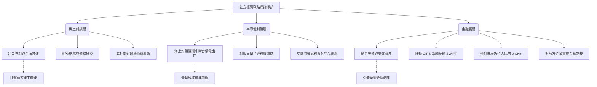

> **防禦研究聲明 (Defense Research Disclaimer)**
> 本文為「亞太區域安全與兵推專案 (WarOfAsia)」之一部分，純屬防禦性學術研究與戰略兵棋推演 (Wargaming) 之想定劇本。本文件旨在探討與分析供應鏈中斷、經濟戰與區域衝突對全球社會韌性之影響，不代表任何真實世界之軍事計畫、政策背書或特定國家之官方立場。所有推演皆基於公開開源情報 (OSINT) 與學術理論模型，旨在提升民主社會之防衛韌性與風險控管能力。

# 專題研究：情境劇本 - 稀土半導體封鎖與金融戰 (Rare Earth & Semiconductor Blockade and Financial Warfare)

## 1. 情境概述與推演背景 (Scenario Overview and Background)

在現代大國博弈中，經濟與科技已成為與傳統軍事力量並駕齊驅的戰略武器。本情境劇本設定於 202X 年代末期，亞太地區地緣政治緊張局勢升溫，紅方（威權主義擴張國家）在發動直接軍事衝突之前，或作為混合戰 (Hybrid Warfare) 的一部分，採取了極具破壞性的「經濟與科技封鎖戰」。

### 1.1 稀土元素全球供應鏈的主導地位
紅方在全球稀土元素 (Rare Earth Elements, REEs) 供應鏈中佔據絕對主導地位。根據當前數據模型，紅方掌握了全球超過 60% 的稀土開採量與高達 85% 以上的加工冶煉能力。稀土元素（如釹 Nd、鐠 Pr、鏑 Dy、鋱 Tb）是製造永磁馬達、軍用雷達、精確制導武器及綠能設備的關鍵原物料。紅方利用此優勢作為地緣政治武器，其實質影響力遠超傳統的石油禁運。

### 1.2 半導體供應鏈的東亞集中度
全球先進半導體製造高度集中於東亞，特別是第一島鏈的藍方前線（如臺灣的台積電 TSMC、韓國的三星 Samsung 與 SK Hynix）。臺灣生產了全球超過 60% 的半導體晶片，以及高達 90% 以上的先進製程晶片。此一「矽盾 (Silicon Shield)」既是防禦的屏障，也是紅方亟欲癱瘓或奪取的戰略目標。

### 1.3 經濟戰作為軍事衝突的替代或前導手段
戰略邏輯上，發動全面軍事戰爭的成本與風險極高。紅方選擇以「經濟戰 (Economic Warfare)」與「供應鏈武器化 (Weaponization of Supply Chains)」作為前導手段，意圖在不動用動能武器的情況下：
1. 削弱藍方聯盟的軍工生產能力。
2. 引發藍方內部的經濟動盪與社會恐慌。
3. 迫使藍方在外交與地緣政治上讓步。

---

## 2. 紅方經濟戰攻勢矩陣 (Red Team Economic Warfare Offensive Matrix)

紅方的經濟戰攻勢是多層次、跨領域的複合打擊，涵蓋原物料、高科技零組件與全球金融體系。

### 2.1 稀土封鎖層 (Rare Earth Blockade Layer)
- **出口管制/禁運**：紅方突然宣佈對特定藍方國家實施稀土產品的全面禁運，特別針對重稀土與高性能永磁材料。
- **價格操控與戰略儲備釋出**：在禁運前，紅方透過市場操作大幅壓低價格，摧毀其他國家的本土稀土開採產業；在禁運時則任由價格飆升，引發通膨。
- **海外礦場收購與壟斷**：透過國家資本，紅方在非洲、南美洲等第三世界國家買斷替代性礦產資源，封死藍方的後路。

### 2.2 半導體封鎖層 (Semiconductor Blockade Layer)
- **封鎖臺灣導致產能中斷**：紅方海空軍在臺灣周邊劃設「禁航區」進行長期軍演，實質阻斷臺灣的進出口物流，導致台積電等晶圓廠因缺乏原物料（如光刻膠、矽晶圓）而停工，晶片無法輸出。
- **對韓國/日本的次級封鎖**：威脅對日韓實施貿易報復，限制其半導體製造設備與原料出口。
- **國內市場議價籌碼**：以其龐大的內需市場作為籌碼，脅迫跨國科技公司（如 Apple、Tesla）在政治上表態或交出技術。

### 2.3 金融戰層 (Financial Warfare Layer)
- **大規模拋售美債**：紅方央行與主權基金在短期內拋售數千億美元的美國國債，意圖推升美國殖利率，引發美元危機與股市崩盤。
- **CIPS 與 SWIFT 對抗**：強制要求其貿易夥伴與附庸國使用人民幣跨境支付系統 (CIPS)，建立獨立於 SWIFT 之外的金融生態圈，削弱美國金融制裁效力。
- **數位人民幣 (e-CNY) 的武器化**：利用區塊鏈技術建立難以追蹤的地下貿易網絡，協助被制裁國繞過美元體系。
- **反制裁機制**：公佈「不可靠實體清單」，凍結藍方跨國企業在紅方境內的資產。

---

## 3. 全球供應鏈衝擊分析 (Global Supply Chain Impact Analysis)

經濟戰一旦啟動，全球化帶來的相互依賴將轉變為脆弱的弱點。

### 3.1 半導體中斷影響矩陣 (Semiconductor Disruption Impact Matrix)

| 產業領域 | 衝擊程度 | 預估庫存枯竭時間 | 主要後果與災難性影響 |
| :--- | :---: | :---: | :--- |
| **軍事系統** (精確制導、雷達) | 極高 | 6-12 個月 | 新型武器交付延宕，精準打擊能力下降；現有裝備妥善率受備品不足影響。 |
| **量子電腦與 AI 晶片** | 毀滅性 | 1-3 個月 | 國家級 AI 研發停滯，算力擴張停止，數據中心伺服器無法更新，影響網路戰能力。 |
| **汽車產業** (電動車、自駕車) | 高 | 2-4 個月 | 全球車廠大規模停工，供應鏈崩潰，導致百萬級失業潮與 GDP 衰退。 |
| **消費電子** (手機、電腦) | 高 | 3-6 個月 | 終端產品價格暴漲，創新週期停滯，依賴科技產品的服務業遭受波及。 |
| **醫療設備** (影像、維生系統) | 中/高 | 6-9 個月 | 高階醫療儀器無法維修與製造，影響公共衛生韌性。 |

### 3.2 稀土中斷影響矩陣 (Rare Earth Disruption Impact Matrix)

| 產業領域 | 影響關鍵元素 | 衝擊程度 | 替代可行性 | 主要後果 |
| :--- | :--- | :---: | :---: | :--- |
| **軍事電子與雷射系統** | 釹 (Nd)、釤 (Sm) | 極高 | 極低 | 戰機雷達、聲納系統與飛彈導引模組生產停擺。 |
| **電動車電池與馬達** | 釹 (Nd)、鏑 (Dy) | 高 | 中/低 | 永磁無刷馬達無法生產，迫使車廠改用低效能感應馬達，打擊綠能轉型。 |
| **風力發電機** | 釹 (Nd)、鐠 (Pr) | 高 | 低 | 離岸風電建設全面停滯，國家能源轉型與碳中和目標跳票。 |
| **光學與雷射系統** | 鑭 (La)、釔 (Y) | 中 | 中 | 高階鏡頭、光纖通訊設備與夜視儀器產能受限。 |

---

## 4. 藍方反制與韌性架構 (Blue Team Countermeasures and Resilience Framework)

藍方（民主同盟）必須啟動「全社會防禦 (Whole-of-Society Defense)」，採取分階段的韌性重建策略。

### 4.1 短期緊急反制 (0-6個月：生存與止血)
- **戰略儲備釋出 (Strategic Reserves Release)**：動用國家安全級別的稀土與晶片儲備（如美國國防後勤局 DLA 庫存），優先配給軍工企業與關鍵基礎設施。
- **啟動國防生產法 (DPA)**：強制民用產能轉向軍工生產，並限制關鍵物資出口至非盟國。
- **金融市場穩定機制 (Financial Stabilization Mechanisms)**：聯準會 (Fed) 聯合各國央行啟動無限量 QE 與貨幣互換協議 (Swap Lines)，吸收被拋售的美債，阻絕流動性危機。
- **緊急替代供應商啟用**：不計成本重啟境內封存的舊礦場或低效能晶圓廠。

### 4.2 中期結構調整 (6-24個月：重組與適應)
- **稀土回收與替代材料開發 (Recycling and Substitutes)**：大力投資城市採礦 (Urban Mining)，從廢棄電子產品中回收稀土；資助材料科學研發無稀土馬達技術。
- **半導體在地化製造加速 (Friendshoring & Onshoring)**：利用《晶片法案》(CHIPS Act) 提供超額補貼，強勢要求半導體產線轉移至美、日、歐境內，建立「去臺化」的備援產能（儘管代價高昂）。
- **多邊貿易聯盟與反封鎖機制**：建立類似北約的「經濟防禦互助條約 (Economic Article 5)」，當一國受到經濟脅迫時，盟國共同實施反制裁。

### 4.3 長期戰略重組 (2-5年：去風險化與系統性隔離)
- **去風險化供應鏈架構 (De-risking Architecture)**：徹底將紅方排除在核心科技與戰略物資供應鏈之外，建立兩個平行的全球化體系。
- **關鍵礦產多元化 (Mineral Diversification)**：投資澳洲、加拿大、南美洲的礦山與本土冶煉廠，建立完整的「非紅方」稀土產業鏈。

---

## 5. 各國影響與反應 (Impact and Reactions of Key Actors)

- **臺灣 (Taiwan)**：首當其衝。若遭到實質封鎖，經濟將面臨崩潰邊緣。政府需啟動《國家動員法》，實行物資配給。台積電的「矽盾」可能失效，甚至面臨廠房自毀協定的抉擇，以避免技術落入敵手。
- **美國 (United States)**：面臨嚴重的金融動盪與軍工產能瓶頸。會利用其美元霸權進行極限金融反擊（如將紅方踢出 SWIFT），並強勢主導全球供應鏈重組。
- **日本 (Japan)**：憑藉深厚的材料科學底蘊，在半導體設備與化學品上進行反制。加速重新軍備，並可能承擔保障海上交通線 (SLOC) 的軍事任務。
- **韓國 (South Korea)**：處於兩難。過度依賴紅方市場，但又必須配合美國的晶片聯盟 (Chip 4)。可能遭遇紅方的精準經濟打擊。
- **歐盟 (European Union)**：將從「戰略自主」轉向全面親美。德國汽車工業將遭受重創，但會加速推動《歐洲關鍵原物料法案》，尋求供應鏈獨立。

---

## 6. 推演結果與教訓 (Wargame Outcomes and Lessons Learned)

### 6.1 三種可能結局路徑
1. **藍方崩潰與妥協 (紅方勝)**：藍方因無法承受經濟衰退與供應鏈斷裂，內部爆發嚴重反戰抗議，導致政治妥協，紅方不戰而屈人之兵，達成改變地緣政治現狀之目的。
2. **升級為熱戰 (雙輸)**：經濟戰與海上封鎖擦槍走火，紅方為打破僵局或藍方為解除封鎖，動用軍事力量，導致第三次世界大戰或區域核威脅。
3. **長期冷戰與雙體系確立 (相持)**：藍方成功撐過初期的陣痛期，完成供應鏈重組。紅方經濟亦因失去全球市場而大幅倒退。世界正式分裂為兩個互不相連的技術與經濟體系。

### 6.2 政策建議 (Policy Recommendations)
- **平時儲備即戰力**：建立國家級「關鍵物資安全存量法」，不僅限於能源，更應涵蓋特定晶片、稀土及前驅化學物。
- **金融防禦兵推**：定期舉辦國家級金融兵棋推演，模擬外匯存底遭凍結、主權債券遭拋售的極端情境。
- **跨國經濟防禦條約**：推動建立「亞太經濟安全互助聯盟」，將經濟脅迫視同攻擊，實施集體反制。

---

## 7. 跨文件參照與導覽 (Cross-References)

如欲深入了解本情境劇本的相關軍事與政治操作，請參閱本專案之其他文件：
- 臺灣防衛與封鎖突破策略：[戰役級海上封鎖突破想定](../專題研究/戰役想定_海上封鎖與反封鎖作戰.md)
- 中國經濟與社會韌性評估：[紅方內部政經脆弱度分析](../專題研究/研究報告_紅方內部脆弱性與經濟制裁效應.md)
- 美日台聯合作戰架構：[美日台同盟協同作戰機制](../專題研究/聯合作戰_美日台協同機制探討.md)
