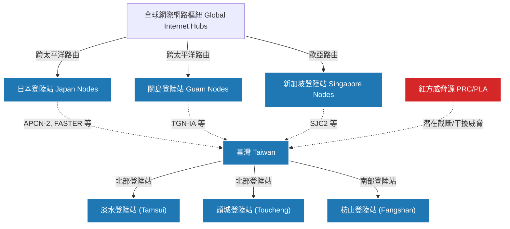
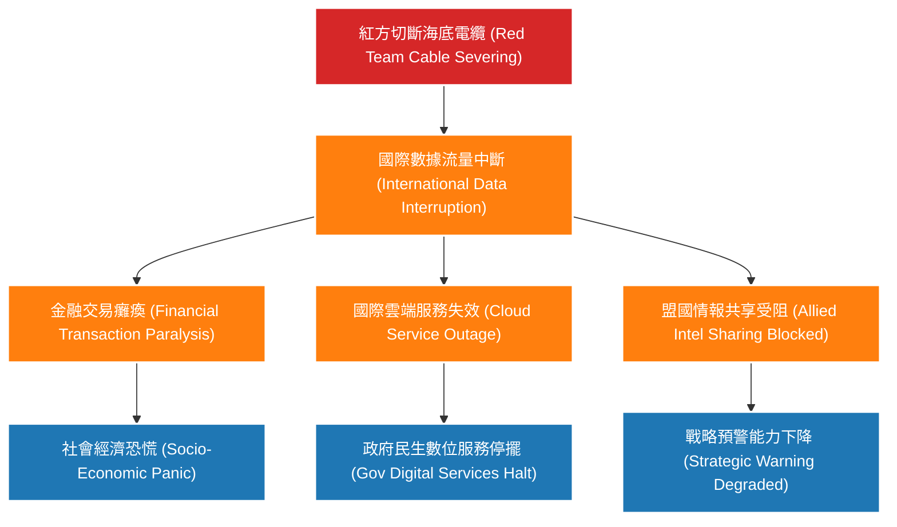
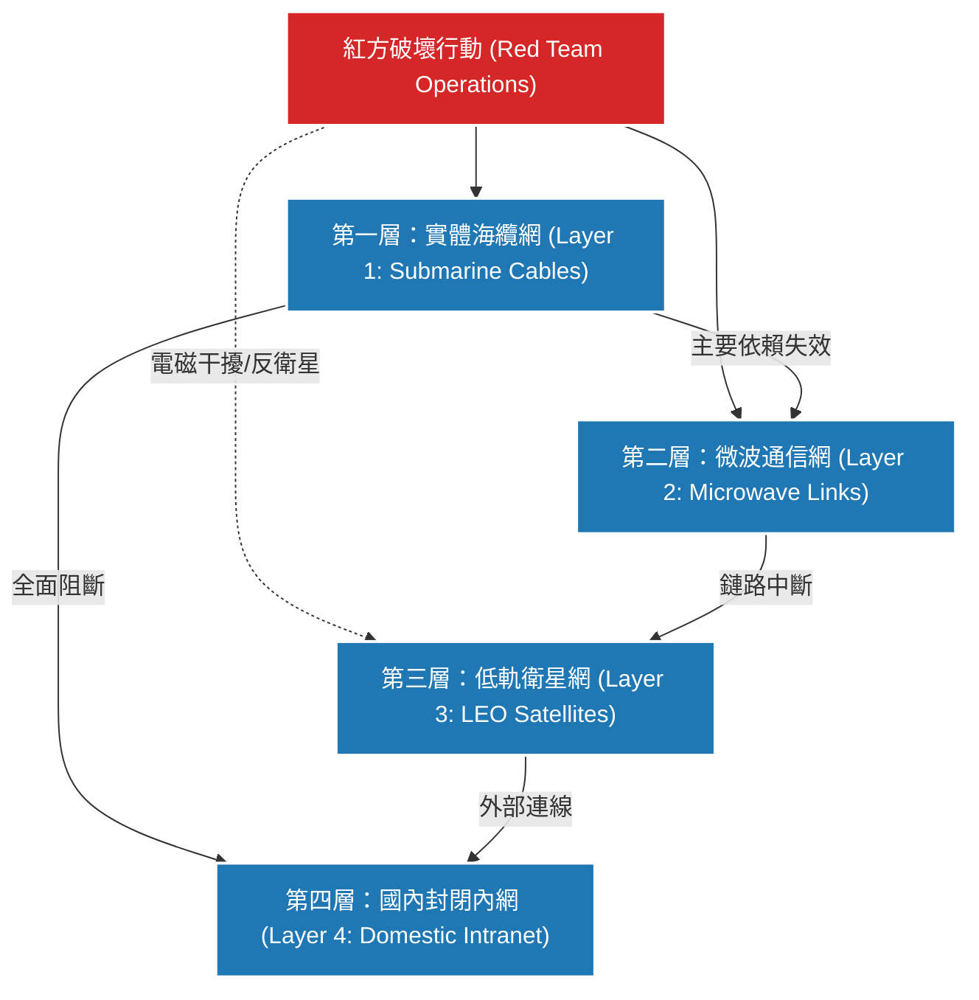

> **Defense Research Disclaimer / 防禦研究聲明**
> 本報告屬學術與軍事防禦架構研究，內容基於公開來源情報（OSINT）、歷史案例與兵棋推演（Wargaming）邏輯構建。報告目的在於強化防禦方（藍方）之戰略韌性（Strategic Resilience）與通信備援（Communication Redundancy）能力，不代表特定政府立場，亦不涉及機密作戰計畫。所有情境與戰術分析均為預防性推演（Preventive Wargaming），旨在提供政策制定者與防務人員參考。

# 專題研究：海底電纜與通信安全_脆弱性與備援分析（Submarine Cable and Communication Security: Vulnerability and Redundancy Analysis）

## 1. 情境概述與戰略背景（Strategic Background and Scenario Overview）

在全球化的數位經濟與資訊作戰環境中，海底電纜（Submarine Communications Cables）構成了全球資訊傳遞的物理主幹。當前，全球超過 95% 的國際數據流量（International Data Traffic）依賴於海底電纜網絡進行傳輸，相較於衛星通信，海底電纜具備大頻寬（High Bandwidth）、低延遲（Low Latency）及高傳輸量等不可替代的優勢。

### 1.1 印太區域海底電纜分布與關鍵節點（Submarine Cable Distribution and Key Nodes in the Indo-Pacific）
印太區域（Indo-Pacific Region）作為全球經濟增長與地緣政治競逐的核心地帶，其海底電纜網絡密度極高。關鍵的路由樞紐包括日本（東京、千葉）、臺灣、香港、新加坡及關島。這些節點不僅承載著區域內的跨國金融交易與數位服務，也是美軍及盟國指管通情（Command, Control, Communications, Computers, Intelligence, Surveillance and Reconnaissance, C4ISR）網路的重要實體基礎。

### 1.2 臺灣海底電纜連接現況（Current Status of Taiwan's Submarine Cables）
臺灣作為第一島鏈（First Island Chain）的關鍵防禦樞紐，目前連接超過 14 條國際海底電纜，主要登陸站（Cable Landing Stations）集中於北部與南部海岸。這些電纜不僅是臺灣與世界接軌的資訊命脈，在戰時或危機爆發時，更是確保政治決策傳達、國際輿論戰（Public Opinion Warfare）發聲及獲取外部情報的關鍵通道。

---

## 2. 紅方威脅分析（Red Team Threat Assessment）

在本報告中，紅方（Red Team）代表中華人民共和國（PRC）與中國人民解放軍（PLA）的戰略威脅體系。紅方近年來積極發展「非對稱作戰（Asymmetric Warfare）」與「灰色地帶戰術（Gray Zone Tactics）」，海底電纜系統被視為破壞藍方（Blue Team）社會運作與軍事指揮的高價值目標（High-Value Targets）。

### 2.1 海底電纜切斷的軍事能力（Military Capabilities for Cable Severing）
紅方具備多層次的海底破壞能力：
- **常規與核子動力潛艦（Conventional and Nuclear Submarines）**：可於深海區域執行隱蔽的電纜切斷或搭線竊聽（Wiretapping）任務。
- **水下無人載具（Unmanned Underwater Vehicles, UUV）**：紅方大量部署各型 UUV，可攜帶切割工具或炸藥，針對淺水區或海溝內的電纜進行精確破壞。
- **海上特種部隊（Maritime Special Forces）**：可針對防護較弱的登陸站近海段進行破壞。

### 2.2 歷史案例研究（Historical Case Studies）
- **北溪管線事件（Nord Stream Pipeline Sabotage）**：展示了水下基礎設施在混合戰（Hybrid Warfare）中的脆弱性，以及溯源歸因（Attribution）的困難。
- **紅海胡塞武裝威脅（Houthi Threats in the Red Sea）**：證明了非國家或代理人武裝亦能對關鍵海底電纜造成實質威脅，導致歐亞間數據延遲。
- **波羅的海與馬祖海纜切斷事件（Baltic Sea and Matsu Cable Incidents）**：2023年馬祖海纜連續遭中方抽砂船及貨輪扯斷，顯示紅方利用民用船隻掩護行動的戰術。

### 2.3 紅方海底作業能力（Red Team Undersea Operations Capabilities）
紅方擁有龐大的海洋調查船隊（Oceanographic Survey Fleets）與深海潛水器（Deep-sea Submersibles，如「蛟龍號」），這些載台在和平時期進行水文調查與海底測繪，戰時則可迅速轉換為電纜定位與破壞的戰術節點。

### 2.4 灰色地帶戰術：以「錨泊」或「漁業活動」掩護的破壞（Gray Zone Tactics: Sabotage Under the Guise of Anchoring or Fishing）
紅方最難以防範的戰術為「意外破壞（Accidental Sabotage）」。利用大型漁船或商船在海纜佈設區域「非法錨泊（Illegal Anchoring）」或進行底拖網作業（Bottom Trawling），造成海纜物理性斷裂。此種手法極難在政治上界定為戰爭行為，完美符合灰色地帶衝突的特徵。

### 2.5 同步切斷多條海纜的戰術可行性（Feasibility of Synchronized Multiple Cable Severing）
在發起全面軍事行動（Kinetic Military Operations）前，紅方有能力協調散布於不同海域的民兵船（Maritime Militia）、潛艦與 UUV，在極短時間內（如 2-4 小時內）同步破壞藍方的多條關鍵海纜，造成瞬間的資訊癱瘓。

### 2.6 紅方對衛星通信的反制能力（Counter-Satellite Capabilities）
紅方深知藍方會啟動備援機制，因此結合了反衛星武器（Anti-Satellite Weapons, ASAT），包含直升式反衛星飛彈（Direct-Ascent ASAT Missiles）、共軌殺傷衛星（Co-orbital Killer Satellites）以及針對地面接收站與衛星鏈路的強大電磁干擾（Electromagnetic Interference, EMI）與網路攻擊（Cyber Attacks），試圖實現全頻譜的通信封鎖。

---

## 3. 脆弱性評估（Vulnerability Assessment）

藍方的通信網絡在面對紅方的系統性打擊時，暴露出多個關鍵脆弱節點。

### 3.1 臺灣海纜集中登陸站風險（Concentration Risks of Taiwan's Cable Landing Stations）
臺灣的國際海纜主要集中於三大登陸站：北部的頭城（Toucheng）與淡水（Tamsui），以及南部的枋山（Fangshan）。這種高度集中的拓撲結構（Topological Structure）形成了明顯的單點故障（Single Point of Failure, SPOF）。紅方只需動用少量精確導引武器（Precision Guided Munitions, PGM）或特種破壞，即可癱瘓多數國際連接。

### 3.2 海纜修復時間與修復船能量（Repair Time and Cable Ship Capacity）
全球目前僅有約 60 艘專業的海纜修復船（Cable Repair Ships）。在平時，修復一條斷裂的海纜需耗時數週至數月。若多條海纜同時斷裂，修復資源將面臨嚴重排擠。

### 3.3 戰時海纜修復的不可行性（Infeasibility of Wartime Cable Repair）
在衝突爆發（Outbreak of Conflict）或高強度對峙期間，海域處於紅方海空火力的威脅下。海纜修復船屬於缺乏自衛能力的慢速民用船隻，在未獲絕對制海權（Sea Control）與制空權（Air Superiority）的情況下，幾乎不可能進入戰區執行修復作業。

### 3.4 連鎖影響（Cascading Effects）
海纜斷裂將引發嚴重的連鎖效應：
1. **金融系統（Financial Systems）**：跨境支付、證券交易與外匯儲備結算中斷，導致經濟恐慌與資金流動性危機。
2. **網路服務（Internet Services）**：公有雲（Public Cloud）服務中斷，依賴 AWS、GCP 等國際雲端的政府與民間應用停擺。
3. **軍事通信（Military Communications）**：雖軍方有獨立微波與戰術資料鏈，但與美印太司令部（INDOPACOM）等盟國的戰略情報交換將受阻。

### 3.5 島國/島嶼經濟體的特殊脆弱性（Unique Vulnerabilities of Island Economies）
相較於大陸型國家可依賴陸地光纜（Terrestrial Fiber-Optic Cables）與鄰國互聯，臺灣作為海島，幾乎 100% 的對外頻寬依賴海纜。這使得「資訊封鎖（Information Blockade）」成為紅方孤立臺灣的有效戰略。

---

## 4. 藍方備援與韌性架構（Blue Team Redundancy Framework）

面對紅方的威脅，藍方必須建構多層次的通信韌性架構（Communications Resilience Architecture）。

### 4.1 衛星通信備援（Satellite Communications Redundancy）
在海纜失效後，衛星通訊將是維持連外的最後防線：
- **低軌道衛星（Low Earth Orbit, LEO）**：如 Starlink、OneWeb，具備低延遲特性，且由大量衛星組成星系（Constellation），單一衛星遭紅方摧毀不會導致網路癱瘓。
- **中軌道/高軌道衛星（MEO/GEO）**：提供大容量的骨幹備援，雖延遲較高，但覆蓋範圍廣。

### 4.2 微波/無線電備援鏈路（Microwave and Radio Backup Links）
在視距內（Line of Sight），建立跨島嶼（如本島至澎湖、金門）或對鄰近友邦（如至日本與那國島）的超視距微波通信（Tropospheric Scatter Communications）網路，作為海纜的實體備援。

### 4.3 海纜路由多樣化策略（Cable Route Diversification Strategy）
分散登陸站點，推動在臺灣東部（如花蓮、臺東）建設新的登陸站，避免過度集中於西岸與北部，增加紅方破壞的難度與成本。

### 4.4 海纜保護區與巡護機制（Cable Protection Zones and Patrol Mechanisms）
劃設海底電纜保護區，結合海巡署（Coast Guard）與海軍的日常巡邏，並建置水下監聽系統（Sound Surveillance System, SOSUS）監控關鍵節點，嚇阻紅方灰色地帶的破壞企圖。

### 4.5 關鍵數據本地化與離線運作能力（Data Localization and Offline Operation Capabilities）
推動「政府資料在地化」與「CDN 本地快取（Local Caching）」。確保在斷網狀態下，國內的發電、供水、醫療及基礎金融系統仍能在「內網（Intranet）」環境下自主運作。

### 4.6 臺灣韌性通信計畫現況（Current Status of Taiwan's Resilience Programs）
臺灣數位發展部（MODA）已推動非同步軌道衛星（NGSO）概念驗證計畫，預計在全臺部署數百個衛星終端點（PoP）。同時，國家太空中心（TASA）亦正研發自主的低軌通訊衛星，旨在降低對外商的單一依賴。

---

## 5. 情境推演：臺海衝突中的通信切斷（Scenario Wargaming: Comm Cut in a Taiwan Strait Conflict）

*引用參考：詳見《48 小時快速想定》與《南海島礁衝突情境》相關段落。*

### 5.1 T-24h：海底電纜預先破壞（T-24h: Preemptive Cable Sabotage）
在正式動武前 24 小時，紅方利用偽裝的漁船與潛艦，在東海、臺灣海峽及巴士海峽同步切斷臺灣超過 80% 的國際海纜。國際網路頻寬瞬間掉落至原本的 10% 以下。

### 5.2 T+0：全面通信封鎖（T+0: Total Communication Blockade）
紅方發射飛彈攻擊頭城、枋山等登陸站設施，並同時開啟高功率電子干擾機，壓制臺灣上空的衛星信號。臺灣對外網路實質癱瘓。

### 5.3 T+6h：備援系統啟動狀態（T+6h: Backup Systems Activation）
藍方啟動緊急衛星通信備援（參考 *受限附件E：海纜衛星與緊急通信容量模板*）。政府轉用 Starlink 等 LEO 網路，維持最高統帥部與華府（Washington D.C.）的熱線（Hotline）。但民間網路完全斷線，社交媒體停擺，紅方趁機發動大規模認知作戰（Cognitive Warfare），散佈政府逃亡的假訊息。

### 5.4 T+24h：資訊孤島效應（T+24h: Information Island Effect）
臺灣國內進入「內網模式」，政府依靠在地化的 CDN 與廣播系統向民眾發布戰報。由於對外頻寬極度受限，只有關鍵的軍事戰術數據與高價值情報得以外傳。

### 5.5 對國際援助協調的影響（Impact on International Aid Coordination）
通信受限導致藍方難以將戰場慘烈的真實畫面即時傳遞給國際社會，延遲了國際輿論的動員與國際制裁（International Sanctions）的啟動。

---

## 6. 國際合作與政策建議（International Cooperation and Policy Recommendations）

### 6.1 海底電纜保護國際公約（International Conventions on Cable Protection）
推動將「蓄意破壞和平時期海底電纜」明確定性為國家級網路攻擊，甚至是戰爭行為。強化《聯合國海洋法公約》（UNCLOS）中關於電纜保護的執行力度。

### 6.2 盟國海纜安全合作機制（Allied Cable Security Cooperation Mechanisms）
藍方與美、日、澳等印太盟國應建立「海纜聯合監控與快速修復聯盟」。平時共享水下監聽情報，戰時確保修復船隊能在盟軍護航下執行搶修。

### 6.3 建議臺灣強化措施（Recommendations for Taiwan）
1. **極限備援演練**：定期舉行無預警的「全島斷網演習」，測試關鍵基礎設施在純內網環境下的存活率。
2. **戰備星系建置**：加速國產低軌衛星計畫，並與多家國際衛星營運商（如 OneWeb, Project Kuiper）簽訂戰時頻寬保證協議。
3. **戰術邊緣運算（Tactical Edge Computing）**：在軍事指揮所與地方政府建置微型資料中心，確保在與中央骨幹網路斷線時，仍能維持局部指管運作。

---
*文件結束 (End of Document)*
