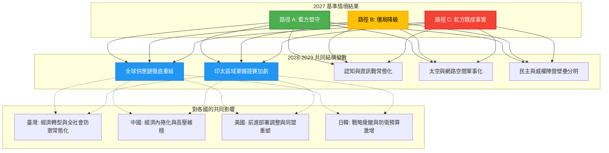

# 2028-2029 後續情境演變（2028-2029 Extended Timeline & Post-Crisis Scenario Evolution）

> **防禦研究聲明 (Defense Research Disclaimer)**
> 本文件為純粹基於防禦型紅隊 (Defensive Red Teaming) 與全社會韌性 (Whole-of-Society Resilience) 藍方觀點所撰寫之學術與戰略分析報告。內容所述情境、推演路徑及相關變數均為假定性學術推演 (Hypothetical Academic Simulation)，旨在提升區域安全認知、防衛準備與政策韌性。本文件不代表任何官方政府立場，亦不為任何實際軍事或侵略行動提供背書。本專案核心宗旨為透過預防性兵推 (Preventive Wargaming) 嚇阻衝突，維護亞太區域之和平與穩定。

---

## 1. 情境概述與推演設定 (Scenario Overview and Wargaming Parameters)

本劇本建立於 WarOfAsia 專案現有的「2027 中共侵臺基準情境 (2027 Baseline Scenario)」之後。假設 2027 年臺海爆發了軍事衝突或高強度的危機（不論最終戰術或戰略結果為何），本文件旨在推演 2028 年至 2029 年亞太區域地緣政治、軍事態勢以及全社會韌性的後續演變 (Post-Crisis Evolution)。

在 2027 年的危機之後，亞太區域的安全架構將經歷不可逆轉的質變。為全面涵蓋可能的未來走向，本推演設定了三種 2027 危機結局後的延伸路徑 (Branching Paths)：
*   **路徑 A (Path A)：藍方堅守後的後續演變** (紅方攻勢受挫，藍方成功防衛)
*   **路徑 B (Path B)：僵局與外交降級後的後續演變** (雙方陷入消耗戰僵局，經國際介入後危機降級)
*   **路徑 C (Path C)：紅方達成既成事實後的後續演變** (紅方成功創造既定事實，迫使藍方部分妥協)

透過比較這三條路徑，我們能更清晰地識別跨情境的共同威脅變數 (Cross-Scenario Common Variables)，並為藍方的長期大戰略 (Grand Strategy) 提供具備高度適應性的政策建議。

---

## 2. 路徑 A：藍方堅守後的後續演變 (Path A: Evolution After Blue Team's Successful Defense)

**前提設定**：在 2027 年的衝突中，藍方（臺灣及其盟友）透過不對稱作戰 (Asymmetric Warfare)、社會韌性及國際軍事介入，成功挫敗了紅方（中國）的兩棲登陸與封鎖企圖。紅方被迫撤軍或轉入極低強度的對峙。

### 2028 年地緣政治變化 (2028 Geopolitical Shifts)

*   **中國內部政治後果 (Domestic Political Consequences in China)**：
    *   **政權穩定性考驗 (Regime Stability Stress)**：對臺動武失敗將對中共高層的統治威信造成毀滅性打擊。內部可能出現劇烈的權力鬥爭 (Factional Purges)，中央對地方的控制力可能因資源枯竭而暫時性削弱。
    *   **軍方問責與清洗 (Military Accountability and Purges)**：解放軍 (PLA) 將面臨大規模的內部清洗與究責，軍心動盪。同時，軍方將被迫進行深刻的「敗戰檢討」，導致軍事戰略從「速戰速決」轉向「長期威懾與重整」。
*   **國際制裁升級與中國經濟影響 (Escalation of International Sanctions and Economic Impact)**：
    *   **全面經濟封鎖 (Comprehensive Economic Blockade)**：G7 及其他民主盟友將維持甚至擴大在衝突期間實施的嚴厲制裁（包含 SWIFT 排除、關鍵技術禁運）。中國經濟將陷入深度衰退，失業率飆升，並加速向「內循環」與戰時經濟體制 (War Economy) 轉型。
*   **臺灣國際地位提升與外交突破 (Taiwan's International Status Elevation and Diplomatic Breakthroughs)**：
    *   **事實上的獨立實體認可 (De Facto Independent Entity Recognition)**：臺灣成功抵禦侵略後，國際社會對其主權與民主體制的認可將達到空前高度。雖未必立即促成普遍的法理建交，但實質性的雙邊防禦協定與高層級外交互訪將常態化。
    *   **國際組織參與 (International Organization Participation)**：在美日等國強烈支持下，臺灣將以觀察員或正式成員身分實質參與更多國際與區域組織。
*   **印太安全架構重組 (Restructuring of the Indo-Pacific Security Architecture)**：
    *   **亞洲版北約的雛形 (Prototyping an "Asian NATO")**：美、日、韓、澳、菲及臺灣之間的多邊安全合作將從模糊走向清晰。情報共享網絡 (Intelligence Sharing Networks) 與聯合指揮架構將加速建立。

### 2029 年軍事與安全態勢 (2029 Military and Security Posture)

*   **中國軍事重建與再動員能力 (China's Military Rebuilding and Remobilization)**：
    *   經過兩年的內部整頓，中國將啟動「軍隊重建計畫」。重點將放在彌補海空軍載具的戰損、升級無人化載具 (UAVs/USVs)、以及強化戰略火箭軍的核威懾能力，以彌補常規兵力的暫時劣勢。
*   **藍方軍事現代化與軍備競賽 (Blue Team's Military Modernization and Arms Race)**：
    *   臺灣在國際軍援下，將全面轉向刺蝟戰略 (Porcupine Strategy)。國防預算將佔 GDP 的 5% 以上，重點發展分佈式防空系統、反艦飛彈陣列及全民防衛力量 (Civilian Defense Forces)。
*   **北韓角色的變化 (The Evolving Role of North Korea)**：
    *   為了分散國際壓力並轉移焦點，中國可能默許或鼓勵北韓在朝鮮半島製造新的危機，迫使美國與日韓分散戰略注意力。這將導致東北亞局勢在 2029 年高度緊繃。

---

## 3. 路徑 B：僵局與外交降級後的後續演變 (Path B: Evolution Following Stalemate and Diplomatic De-escalation)

**前提設定**：2027 年衝突爆發後，雙方皆無法迅速達成決定性戰果。紅方無法登陸，但藍方也面臨嚴重的基礎設施破壞與封鎖壓力。在國際強力斡旋與相互保證毀滅 (MAD) 的威脅下，雙方達成某種形式的停火與危機降級。

### 2028 年談判與外交消耗 (2028 Negotiations and Diplomatic Attrition)

*   **停火協議與口實典焦 (Ceasefire Agreements and Creation of New "Status Quo")**：
    *   **海峽中線與 ADIZ 的新常態 (New Norms for the Median Line and ADIZ)**：紅方將拒絕承認過往的默契，停火線可能實質推移至臺灣本島近海。紅方機艦將常態化在臺灣鄰接區邊緣巡弋，形成極具壓迫感的「新現狀」。
    *   **長期談判消耗 (Prolonged Negotiation Attrition)**：雙方進入邊打邊談的狀態。紅方利用談判拖延時間以恢復軍力，藍方則爭取時間修復關鍵基礎設施 (Critical Infrastructure)。
*   **經濟脱鉤加速與供應鏈重組 (Accelerated Economic Decoupling and Supply Chain Restructuring)**：
    *   **半導體供應鏈的快速轉移 (Rapid Shift of Semiconductor Supply Chains)**：全球意識到臺灣產能的脆弱性，將不計代價加速「去臺灣化」與「去中國化」。美、日、歐的晶片法案將發揮實質效應，臺灣面臨嚴重的產業外移壓力與「矽盾 (Silicon Shield)」減弱的危機。
*   **社會創傷與民意變化 (Societal Trauma and Shifts in Public Opinion)**：
    *   臺灣社會經歷戰火洗禮後，將出現民意極化 (Polarization)。一方面，抵抗意志可能因創傷而更為堅定；另一方面，對於戰爭的恐懼與經濟衰退的壓力，也可能催生出強烈的「和平主義」與妥協聲音。

### 2029 年不穩定平衡 (2029 Unstable Equilibrium)

*   **灰色地帶活動是否重啟 (Resumption of Grey-Zone Activities)**：
    *   紅方將把常規衝突降級為高強度的「混合戰 (Hybrid Warfare)」。包括對臺灣進行持續的網路攻擊 (Cyber Attacks)、海底電纜破壞、針對性經濟制裁以及認知作戰 (Cognitive Warfare)，試圖在不觸發全面戰爭的情況下瓦解藍方社會韌性。
*   **軍事信任措施建立 (Establishment of Military Confidence-Building Measures - CBMs)**：
    *   在美國的強力介入下，中美台三方可能建立有限的熱線機制與危機管理協議，以防止擦槍走火引發第二次大戰。但這些機制的互信基礎極度脆弱。
*   **區域軍備控制的可能性 (Possibility of Regional Arms Control)**：
    *   國際社會可能推動限制某些攻擊性武器（如中程導彈）部署於第一島鏈的協議。這對藍方的防禦準備將是雙面刃，既可能降低緊張，也可能限制藍方的反擊能力。

---

## 4. 路徑 C：紅方達成既成事實後的後續演變 (Path C: Evolution After Red Team Achieves Fait Accompli)

**前提設定**：紅方在 2027 年利用突襲或藍方盟友反應不及，成功佔領了臺灣部分離島（如金門、馬祖、澎湖）甚至本島部分戰略要地，並成功實施了實質性封鎖。藍方政府在極大壓力下被迫接受部分妥協條件。

### 2028 年印太震盪 (2028 Indo-Pacific Shockwave)

*   **臺灣地位變化與內部動盪 (Taiwan's Status Shift and Internal Upheaval)**：
    *   **主權實質受損 (Substantive Loss of Sovereignty)**：臺灣可能被迫簽署具備過渡性質的「和平協議」，實質上被納入紅方的勢力範圍。
    *   **社會撕裂與抵抗運動 (Social Tearing and Resistance Movements)**：政府威信崩潰，社會內部將爆發嚴重的衝突。不願妥協的民眾與軍隊可能轉入地下，發起游擊戰 (Guerrilla Warfare) 或長期抵抗運動。資本與人才將發生災難性的大量外流 (Brain Drain and Capital Flight)。
*   **印太安全信用崩壞與重建 (Collapse and Reconstruction of Indo-Pacific Security Credibility)**：
    *   **美國安保承諾的破產 (Bankruptcy of US Security Commitments)**：美國未能成功保衛臺灣，將導致其在印太地區的威信掃地。盟邦對美國的延伸嚇阻 (Extended Deterrence) 產生嚴重懷疑。
*   **日韓加速軍事自主化 (Japan and South Korea Accelerate Military Autonomy)**：
    *   面對中國的步步進逼及對美國的疑慮，日本與韓國將迅速廢除和平憲法限制，啟動大規模擴軍。甚至將公開討論「核武裝化 (Nuclearization)」的選項，以確保自身安全。
*   **全球經濟裂解與雙軌體系 (Global Economic Fragmentation and Dual-Track Systems)**：
    *   世界將正式分裂為以美國為首與以中國為首的兩個互不兼容的經濟與技術體系。全球化徹底終結。

### 2029 年新秩序形成 (2029 Formation of a New Order)

*   **中國印太擴張與國際反彈 (China's Indo-Pacific Expansion and International Backlash)**：
    *   中國將以臺灣（或其周邊）為前進基地，將軍事投射能力向第二島鏈（關島）及南海深處推進。這將引發周邊國家更強烈的聯合反彈，形成實質的「對華包圍網」。
*   **核武擴散與軍事化加劇 (Nuclear Proliferation and Intensified Militarization)**：
    *   區域內的核門檻將被打破。為了抗衡中國，印太地區的常規軍備競賽將升級為核威懾競賽。
*   **新型威嚇與嚇阻架構 (New Coercion and Deterrence Architecture)**：
    *   藍方殘存力量（可能為流亡政府或局部抵抗力量）將仰賴不對稱的「焦土戰略」與對中國本土的報復能力（如網路戰）來維持最後的嚇阻力。

---

## 5. 跨路徑共同變數分析 (Analysis of Cross-Path Common Variables)

無論 2027 年的衝突結局為何，某些結構性的趨勢在 2028-2029 年都將無可避免地發生。以下 Mermaid 圖表展示了跨越三條路徑的共同變數。

**共同變數詳述：**
1.  **供應鏈重組不可逆**：戰爭風險已被完全定價，外資撤出交戰區的趨勢不會因停火而改變。
2.  **軍備競賽常態化**：和平紅利 (Peace Dividend) 消失，亞太各國將進入高強度的武裝狀態。
3.  **太空與網路戰成為首要領域 (Space and Cyber Domains)**：未來兩年的衝突將從實體領域大幅轉向電磁、網路與低軌道衛星的爭奪。

---

## 6. 對現有 17 項預警指標的延伸建議 (Extensions to the Existing 17 Early Warning Indicators)

現有的預警指標主要針對「衝突爆發前」的徵候。針對 2028-2029 年的「戰後/衝突後」階段，需對既有指標進行修正，並增加新的預警指標以監測紅方的恢復狀況與新動向。

**需調整的現有指標範例**：
*   原指標：*解放軍東部戰區物資集結* -> **調整為**：*戰損評估修復率與新一代裝備換裝速度 (Battle Damage Repair Rate and Next-Gen Equipment Deployment)*。
*   原指標：*民間滾裝船徵用* -> **調整為**：*戰略運輸能量的重組與軍民融合 (Civil-Military Integration) 的新法規*。

**2028-2029 新增預警指標建議 (New Indicators for 2028-2029)**：

1.  **政治與社會穩定指標 (Political and Social Stability Indicators)**：
    *   **紅方內部究責規模**：監測中共軍方與政法系統的高層人事異動，判斷其是否正在肅清反戰派或為下一波衝突準備。
    *   **紅方戰時體制法制化**：觀察中國是否將衝突期間的緊急法令常態化（如糧食配給、外匯嚴格管制）。
2.  **外交與國際結盟指標 (Diplomatic and Alliance Indicators)**：
    *   **中俄朝伊軸心實質化**：監測中國與俄羅斯、北韓、伊朗之間的軍事技術轉移與聯合演習頻率。
    *   **紅方對第一島鏈各國的經濟脅迫精準度**：觀察紅方是否發展出更隱蔽、具針對性的經濟制裁工具來分化藍方同盟。
3.  **新型態軍事準備指標 (New Forms of Military Preparation)**：
    *   **無人機與 AI 蜂群戰術演練**：紅方勢必在戰後大幅投資無人載具，需監控其無人機工廠產能與戰術演練頻率。
    *   **低軌衛星發射頻率與反衛星 (ASAT) 測試**：太空領域的控制將是 2028 年後的焦點。

---

## 7. 結論與政策建議 (Conclusion and Policy Recommendations)

**三條路徑的整體評估**：
2028-2029 年的亞太局勢將是一個「高壓震盪」的過渡期。路徑 A 雖能確保臺灣生存，但將面臨紅方瘋狂的報復性重整；路徑 B 是最痛苦的消耗戰，考驗社會的長期韌性；路徑 C 則是災難性的體系崩潰。共同點在於，**「回到 2027 年以前的現狀」已絕對不可能。**

**對藍方的長期戰略建議 (Long-term Strategic Recommendations for the Blue Team)**：

1.  **全社會防禦法制化 (Institutionalize Whole-of-Society Defense)**：
    不能僅將防衛責任交由軍方。必須在 2028 年前將民防 (Civil Defense)、關鍵基礎設施保護 (CIP) 與戰略物資儲備寫入具有強制力的基本法中。
2.  **推動「分散式韌性」經濟架構 (Distributed Resilience in Economics)**：
    面對供應鏈重組，臺灣不能只依靠單一半導體產業。應發展分散式的微電網、在地化的糧食與醫療物資生產線，確保在極限封鎖下社會不崩潰。
3.  **不對稱戰力與源頭打擊並重 (Balance Asymmetric and Counter-Strike Capabilities)**：
    軍事建設除了刺蝟戰術，必須發展足夠數量的長程精準火力 (Long-range Precision Strike)，以建立戰後的實質嚇阻力，讓紅方明白任何再次發動衝突的企圖都將付出不可承受的代價。
4.  **建立「戰時/戰後國際溝通備援機制」 (Redundant International Communication Mechanisms)**：
    確保在海底電纜全數斷線的情況下，仍能透過低軌衛星網路與國際社會保持即時資訊同步，反制紅方的資訊封鎖與認知作戰。

---

## 8. 跨文件參照與導覽 (Cross-Reference Links)

為確保專案分析的連貫性，請參照以下 WarOfAsia 專案之相關文件：

*   **基準情境總版**：2027 中共侵臺基準情境總表
    *   [2027_基準情境總版.md](../臺灣/2027_基準情境總版.md)
*   **藍方防衛卷**：全社會韌性與國軍防衛推演
    *   [藍方防衛_全社會韌性分析.md](../臺灣/藍方防衛_全社會韌性分析.md)
    *   [藍方防衛_不對稱作戰部署.md](../臺灣/藍方防衛_不對稱作戰部署.md)
*   **紅方行動卷**：解放軍戰役企圖與混合戰分析
    *   [紅方行動_混合戰與灰色地帶.md](../中國/紅方行動_混合戰與灰色地帶.md)
    *   [紅方行動_兩棲與封鎖想定.md](../中國/紅方行動_兩棲與封鎖想定.md)
*   **國際預警卷**：17項戰略預警指標清單
    *   [預警指標_17項戰略預警清單.md](../國際/預警指標_17項戰略預警清單.md)

---
*文件修訂版本：1.0 | 建立日期：2026-08-05*
