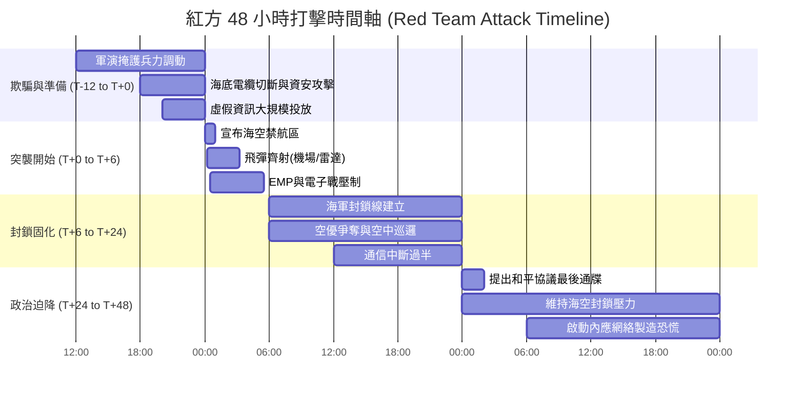
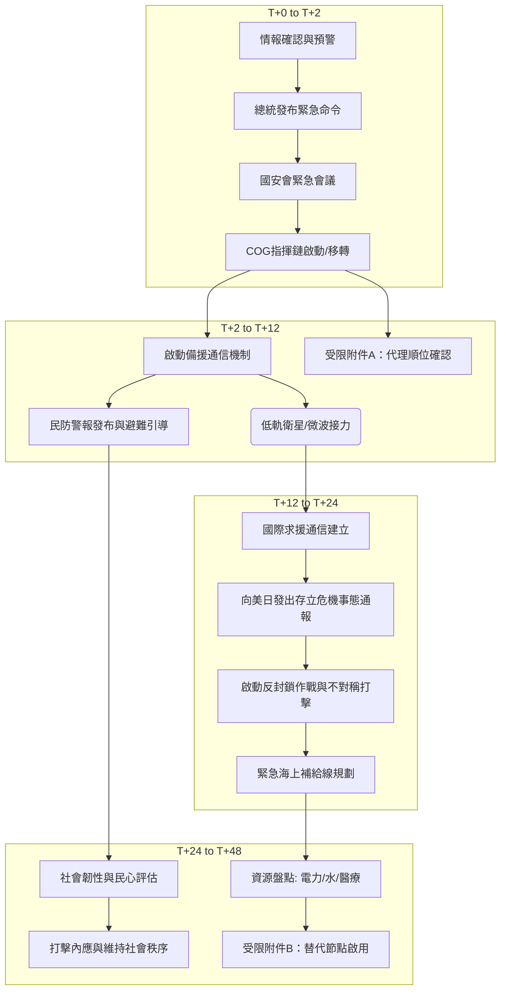

> **防禦研究聲明 (Defense Research Disclaimer)**
> 本文件為《WarOfAsia》專案之學術與防衛兵棋推演（Wargaming）研究成果。內容基於公開來源情報（OSINT）、防禦型紅隊（Defense-oriented Red Team）方法學以及全社會韌性（Total Society Resilience）框架所建構之假想情境。本報告旨在探討防衛機制與社會韌性之極限，無意煽動衝突或代表任何官方立場。所有想定皆為壓力測試（Stress Test）之用。

# 情境劇本：臺海危機 48 小時快速想定 (Taiwan Strait 48-Hour Rapid Scenario)

## 1. 情境概述與推演設定

### 1.1 推演背景
本想定探討一種極端但具備戰術合理性的劇本：中國人民解放軍（PLA，紅方）在極少或無充分戰略預警（Strategic Warning）的情況下，利用例行軍事演習作為掩護，於 48 小時內對臺灣（藍方）實施海空全面封鎖（Comprehensive Sea and Air Blockade）與關鍵基礎設施的癱瘓打擊。此情境被稱為「48小時快速想定」（48-Hour Rapid Scenario）。

### 1.2 與現有 2027 基準情境的差異
在傳統的 2027 基準情境（Baseline Scenario）中，紅方通常會有長達數週至數月的兵力集結期（Force Buildup），藍方與國際社會（如美國、日本）有充足的時間進行情報徵候（Indications & Warnings, I&W）的確認與預防性部署。
本想定（極端想定）的差異在於：
1. **極度壓縮的預警時間**：紅方將「冷啟動」（Cold Start）能力推至極限，利用「演習轉戰備」的模糊性，將戰略預警時間壓縮至 12 小時以內。
2. **非對稱與混合戰先導**：大規模動用網路戰（Cyber Warfare）、認知作戰（Cognitive Warfare）與電磁脈衝（EMP），在物理打擊前先癱瘓藍方社會神經。
3. **無登陸的極限施壓**：前 48 小時內不發動兩棲登陸，而是透過導彈齊射、海空封鎖與通信切斷，意圖在國際介入前達成政治迫降（Political Capitulation）。

### 1.3 推演目的
本情境旨在測試藍方在「極短時間、極大壓力」下的反應能力上限（Reaction Capacity Limit），特別是：
- 國家指揮當局（National Command Authority, NCA）的存活與指管通情（C4ISR）韌性。
- 社會大眾在資訊真空與恐慌下的自我組織與民防能力。
- 備援基礎設施（受限附件所列之節點）在首波打擊中的生存率與切換效率。

---

## 2. 紅方 48 小時打擊時間軸 (Red Team Timeline)

紅方之行動綱領為「猝不及防、全面壓制、封鎖隔離」。

### 2.1 T-12小時 至 T+0：最後準備與欺騙行動
- **軍事演習為掩護調動兵力**：東部戰區藉由例行性「聯合利劍」規模演習，將海軍驅逐艦支隊、空軍戰鬥機編隊前推至海峽中線及臺灣東部海域，模糊平戰界線。
- **海底電纜切斷與資安攻擊**：透過偽裝漁船與特種潛艦，同時物理切斷連接臺灣本島與離島、國際之多條關鍵海底光纜。APT 駭客組織對臺灣電網（SCADA系統）、金融中樞及政府網站發動 DDoS 與勒索軟體攻擊。
- **認知戰與虛假資訊大規模投放**：利用深偽技術（Deepfake）在社群媒體散布「藍方高層已逃亡」、「外島已投降」之假訊息，製造首波社會恐慌。

### 2.2 T+0 至 T+6小時：突襲開始
- **宣布海空禁航區**：T+0 時，紅方單方面宣布臺灣周邊海空域為「實彈演習禁航區」（No-Fly/No-Sail Zones），實質上啟動封鎖。
- **飛彈齊射（Missile Salvo）**：東風系列彈道飛彈（DF-15/16）與長劍巡弋飛彈從多維度發射。**瓶頸標的（Chokepoint Targets）**包含：樂山雷達站、各空軍基地跑道、防空飛彈陣地、以及衡山指揮所等通信節點。
- **電磁脈衝（EMP）或電子戰壓制**：利用高空核爆 EMP（HEMP）或非核電磁脈衝武器（NNEMP），癱瘓北部都會區的未屏蔽電子設備，伴隨強烈的通信干擾（Jamming）。

### 2.3 T+6 至 T+24小時：封鎖固化
- **海軍封鎖線建立**：解放軍水面艦艇與潛艦在東北、西南、東部海域建立封鎖截擊區，禁止任何能源船隻進出。
- **空優爭奪與空中巡邏**：殲-20、殲-16 進入臺灣周邊空域進行戰鬥巡邏（CAP），壓制藍方殘存防空力量。
- **對外通信中斷過半**：由於海底電纜全斷與衛星通信干擾，藍方對外互聯網頻寬降至平時的 10% 以下，陷入資訊孤島。

### 2.4 T+24 至 T+48小時：政治迫降或登陸準備
- **提出「和平協議」最後通牒**：紅方透過未被干擾的特定廣播頻道，向藍方提出 48 小時內接受「和平協議」的最後通牒，否則將進行全面兩棲登陸與無差別轟炸。
- **內應網絡啟動**：紅方潛伏於藍方內部的第五縱隊（Fifth Column）與同路人網絡開始活動，攻擊備援變電所，並在都會區煽動擠兌與暴亂。

---

## 3. 藍方緊急應變流程 (Blue Team Emergency Response)

面對突發的極端打擊，藍方全社會韌性架構面臨最嚴峻的考驗。

### 3.1 T+0 至 T+2小時：威脅判斷與即時反應
- **總統宣布緊急命令**：在遭受首波飛彈攻擊確認後，總統依法發布緊急命令，凍結平時法規，全國進入戰時狀態。
- **國安會緊急會議與 COG 啟動**：政府延續運作（Continuity of Government, COG）機制立即啟動。正副總統與行政院長分流進入不同地下指揮所（如衡山、圓山或備援中心），防止遭「斬首」打擊。

### 3.2 T+2 至 T+12小時：防衛動員與通信備援
- **啟動備援通信**：面對斷網威脅，藍方立即啟動預置的低軌衛星（如 Starlink 等效系統）網路、軍用微波通信接力，以及微弱的短波廣播（HF），維持政府對內對外廣播能力。
- **民防警報與避難引導**：透過細胞廣播系統（若仍存活）及防空警報，引導民眾進入地下室與防空設施。
- **受限附件 A 代理順位確認**：針對在首波打擊中失聯的地方首長或部會首長，依據《受限附件 A：代理順位與指揮鏈重組方案》自動由副手或指定代理人接管指揮權。

### 3.3 T+12 至 T+24小時：國際求援與主動反制
- **向美日發出「存立危機事態」通報**：透過軍事熱線與保密衛星通道，向美軍印太司令部及日本內閣官房通報事態嚴重性，請求情報共享、後勤補給及軍事介入。
- **啟動反封鎖作戰方案**：海軍殘存的微型飛彈快艇（FAC）、海巡艦艇，配合岸置反艦飛彈（如雄風系列、魚叉飛彈）實施非對稱拒止，阻止紅方艦艇過度逼近領海。
- **緊急海上補給線確保**：規劃東部（如花蓮、蘇澳）突破口，準備迎接友盟物資。

### 3.4 T+24 至 T+48小時：持久戰與韌性測試
- **評估電力/水資源/醫療量能**：電網若遭破壞，啟動區域微電網（Microgrids）與關鍵設施（醫院、指揮所）柴油發電機。評估天然氣安全存量是否能撐過兩週。
- **受限附件 B 替代節點啟用**：若主要雷達站或變電所遭摧毀，依據《受限附件 B》啟用機動雷達車與備援饋線。
- **社會韌性與民心穩定評估**：民防組織（如黑熊學院訓練之人員、義警消）協助維持秩序，打擊第五縱隊的造謠與破壞，防止物資搶奪。

---

## 4. 關鍵影響評估與脆弱性分析

在 48 小時極端壓力測試下，藍方的脆弱性（Vulnerabilities）將徹底暴露：

### 4.1 通信中斷後的指揮鏈脆弱性
- **斷點風險**：海底電纜斷裂後，雖有低軌衛星，但頻寬極度受限，無法傳送大量作戰圖資。若紅方成功干擾衛星下行鏈路（Downlink），地方政府與中央可能徹底失聯。
- **評估**：基層單位的「任務式指揮」（Mission Command）能力將決定抵抗效能。缺乏中央指令時，地方防衛部隊能否自主作戰是關鍵。

### 4.2 48 小時內電力/水資源儲備
- **電力脆弱性**：藍方高度依賴進口液化天然氣（LNG），安全存量通常僅約 10-14 天。若主要接收站（如永安、台中、觀塘）在首波打擊中受損或被封鎖，電網將面臨大規模崩潰風險。
- **水資源與醫療**：醫院備用電力通常設計為支撐 48-72 小時。大量傷患湧入將瞬間擊穿都會區的醫療承載上限。

### 4.3 國際支援到達時間與現實延遲
- **距離的暴政（Tyranny of Distance）**：即便美國決定介入，從決定到實際兵力（如航母打擊群）抵達臺灣周邊，通常需要 48 至 72 小時以上（視第七艦隊當前位置而定）。藍方必須具備獨立支撐前幾日最黑暗時期的絕對能力。

### 4.4 社會恐慌與資訊真空之影響
- **心理衝擊**：在無預警下遭受攻擊，加上網路斷線，民眾將面臨極大的資訊焦慮。紅方的深偽假影片若無法被及時澄清，可能引發軍隊譁變或群眾向政府施壓投降的政治危機。

---

## 5. 多國外溢與聯動反應

48 小時封鎖劇本不僅是兩岸問題，更將引發印太區域的連鎖反應。

### 5.1 美國：航母打擊群調動與情報支援
- **反應時間**：若雷根號或卡爾文森號航母打擊群（CSG）位於菲律賓海或日本近海，在接獲情報的 12 小時內將進入高度戰備，但要實質打破封鎖線，美軍需先評估紅方反艦彈道飛彈（A2/AD，如 DF-21D）的威脅。前 48 小時內，美方最實質的支援將是**即時衛星情報共享**與**網路戰反制**。

### 5.2 日本：存立危機事態認定與自衛隊部署
- **政治決斷**：紅方若封鎖臺灣周邊，必然波及日本西南諸島（如與那國島、石垣島）。日本政府極可能在 T+12 至 T+24 小時內召開國家安全保障會議，認定為「存立危機事態」（Survival-Threatening Situation）。
- **軍事部署**：自衛隊將啟動防空與反艦飛彈連戒備，並可能為美軍提供後勤支援，同時進行離島居民撤離（Evacuation）。

### 5.3 韓國：北韓是否同步牽制
- **聯動風險**：駐韓美軍若試圖南下馳援，紅方極可能唆使北韓在 38 度線或黃海進行挑釁（如試射飛彈或砲擊），藉此將韓國軍隊與駐韓美軍牽制在朝鮮半島。

### 5.4 國際社會：聯合國與制裁反應時間
- 聯合國安理會將陷入癱瘓（因紅方擁有否決權）。
- G7 國家可能在 48 小時內發表聯合譴責並啟動經濟制裁（SWIFT 剔除、資產凍結），但經濟制裁對改變紅方前 48 小時的軍事決心毫無幫助。

---

## 6. 推演結果與教訓 (Lessons Learned)

### 6.1 三種可能結局路徑
1. **藍方堅守，等待援軍（藍方勝算路徑）**：藍方成功維持政府運作，備援通信發揮作用，社會未崩潰，撐過 48 小時後美日聯軍開始實質介入，紅方被迫轉入消耗戰或尋求談判下台階。
2. **戰略僵局與絞肉機（消耗戰路徑）**：藍方基礎設施受損嚴重，但紅方未能有效登陸或迫降藍方，雙方在海峽周邊形成高強度的飛彈與海空消耗戰，全球經濟因供應鏈中斷而重創。
3. **紅方得手，藍方迫降（紅方勝算路徑）**：紅方的先期網路戰與 EMP 成功癱瘓藍方指揮鏈，社會因假訊息與斷水斷電陷入暴亂，在美軍抵達前，部分政軍高層妥協，簽署和平協議。

### 6.2 對藍方的關鍵教訓與政策建議
- **去中心化與韌性**：不能將指管通情依賴於單一的光纜或巨型雷達站。必須建立高度分散、行動化、具備抗干擾能力的網狀網路（Mesh Network）。
- **民防是最後防線**：在常規武力被壓制時，社會大眾的抗壓性是抵抗意志的核心。平時必須進行針對斷網、斷電情境的大規模全社會演習。
- **天然氣安全存量致命傷**：必須提升戰備儲煤與再生能源微電網的結合，減少對短期進口能源的絕對依賴。

### 6.3 對受限附件 A-E 的改進建議
- **受限附件 A（代理順位）**：需加入「當代理人亦失聯時，AI 或預置演算法輔助戰術決策」的探討。
- **受限附件 C（民生物資配給）**：需針對「前 48 小時內自動啟動配給制」建立無網連線（Offline）的配給驗證機制。

---

## 7. 跨文件參照與導覽

本情境劇本為《WarOfAsia》臺灣卷之核心測試情境，閱讀時請搭配下列文件以獲得完整全貌：

- [臺灣防禦型紅隊綱要 (Taiwan Red Team Blueprint)](file:///i:/Project/WarOfAsia/臺灣/防禦型紅隊綱要.md)
- [受限附件 A：代理順位與指揮鏈重組方案 (Restricted Annex A)](file:///i:/Project/WarOfAsia/臺灣/受限附件A_代理順位.md)
- [受限附件 B：關鍵基礎設施替代節點 (Restricted Annex B)](file:///i:/Project/WarOfAsia/臺灣/受限附件B_替代節點.md)
- [全社會韌性整合報告 (Total Society Resilience Integration Report)](file:///i:/Project/WarOfAsia/臺灣/全社會韌性整合報告.md)

*(End of Document - 專案版本 v1.0)*
